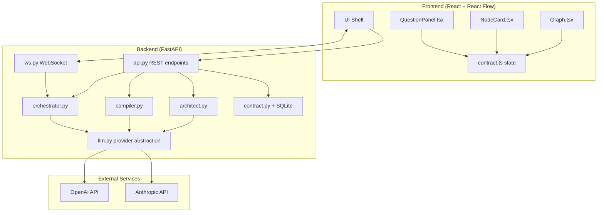
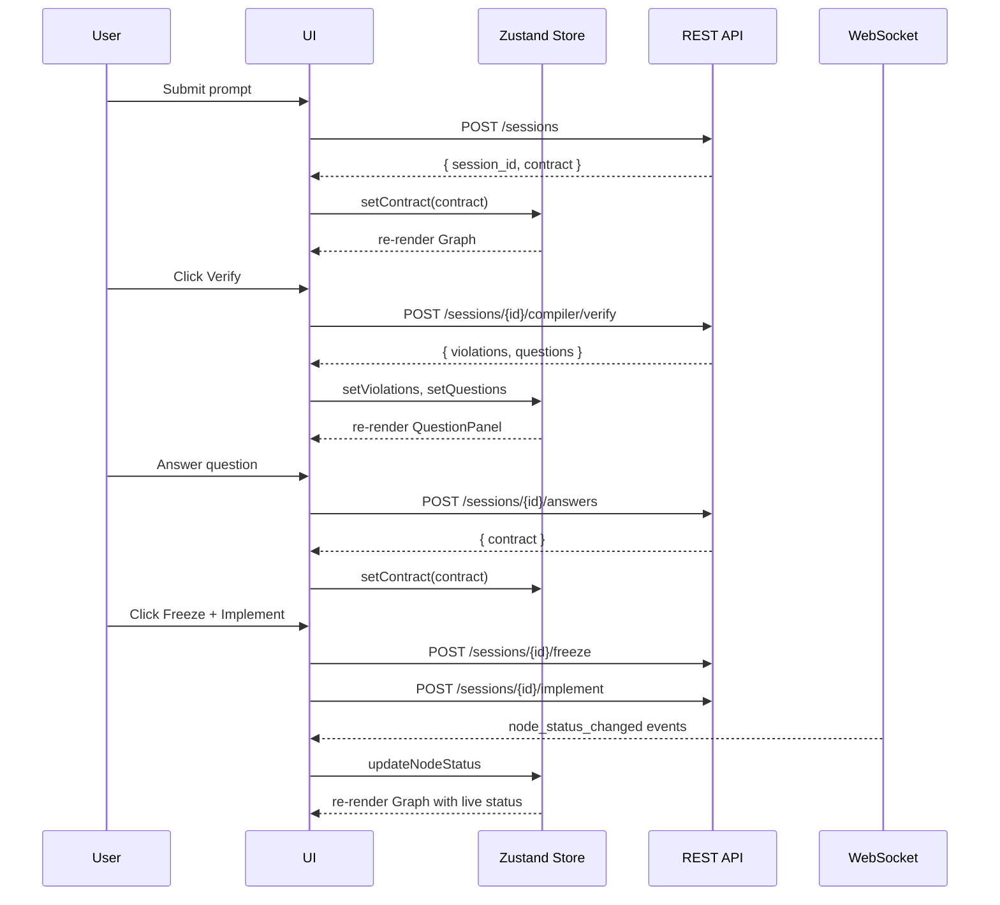
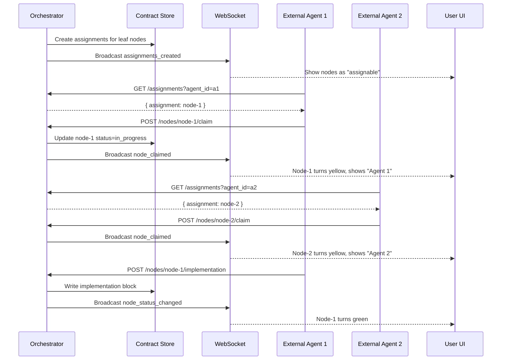
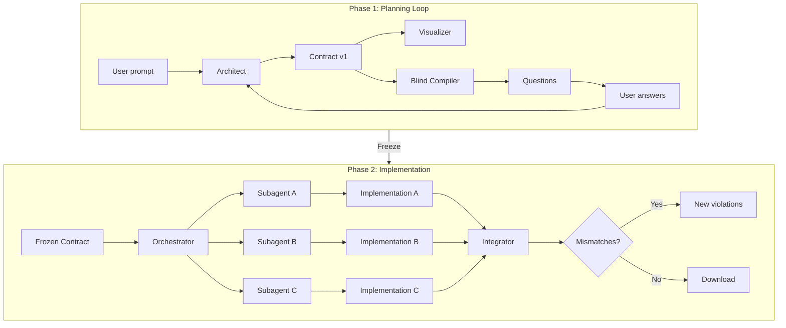

# ARCHITECTURE.md — Glasshouse System Design

This document defines the technical architecture: system topology, module layout, API surface, and — most critically — the `architecture_contract.json` schema that is the shared source of truth between user, Architect, Compiler, and implementation subagents.

See [SPEC.md](SPEC.md) for product requirements and [TODO.md](TODO.md) for build milestones.

---

## 1. System Overview



### 1.1 Technology choices

| Layer | Choice | Rationale |
|-------|--------|-----------|
| Backend framework | FastAPI | Native async, Pydantic models, easy WebSocket support |
| Database | SQLite (single file) | Zero-config, sufficient for single-user hackathon demo |
| LLM integration | OpenAI / Anthropic via `instructor` | Structured outputs with JSON schema enforcement; provider-agnostic wrapper |
| Frontend framework | React 18 + TypeScript | Mature ecosystem, hooks-based state |
| Graph rendering | React Flow | Deterministic layout via dagre/elk, custom node renderers, built-in pan/zoom/select |
| State management | Zustand | Minimal boilerplate, easy WebSocket integration |
| Styling | Tailwind CSS | Rapid iteration, utility classes |

---

## 2. Backend Module Layout

```
backend/
├── app/
│   ├── __init__.py
│   ├── main.py              # FastAPI app factory, CORS, lifespan
│   ├── api.py               # REST route definitions
│   ├── ws.py                # WebSocket route + connection manager
│   ├── architect.py         # Architect agent logic
│   ├── compiler.py          # Blind Compiler verification passes
│   ├── orchestrator.py      # Phase 2 subagent dispatch + integration
│   ├── contract.py          # Contract CRUD, SQLite persistence, schema validation
│   ├── agents.py            # External agent registry
│   ├── assignments.py       # Node work assignments for Phase 2
│   ├── llm.py               # Provider abstraction (OpenAI/Anthropic)
│   ├── schemas.py           # Pydantic models for contract, violations, questions, agents
│   ├── logger.py            # Structured logging with debug mode support
│   └── prompts/
│       ├── architect.md     # System prompt for Architect
│       ├── compiler.md      # System prompt for Blind Compiler
│       ├── subagent.md      # System prompt for implementation subagents
│       └── integrator.md    # System prompt for integration pass
├── tests/
│   ├── __init__.py
│   ├── conftest.py          # Pytest fixtures (test client, mock LLM, sample contracts)
│   ├── test_schemas.py      # Schema validation tests
│   ├── test_contract.py     # Contract CRUD + persistence tests
│   ├── test_compiler.py     # Invariant check unit tests (deterministic)
│   ├── test_architect.py    # Architect output validation (mocked LLM)
│   ├── test_orchestrator.py # Phase 2 dispatch logic tests
│   ├── test_api.py          # API endpoint integration tests
│   └── fixtures/            # Test contract JSONs
│       ├── valid_small.json
│       ├── valid_medium.json
│       └── invalid_*.json   # Various invalid contracts for edge cases
├── scripts/
│   ├── eval_compiler.py     # Compiler tuning harness (M1)
│   └── seed_contracts/      # Hand-built test contracts for eval
├── generated/               # Output directory for Phase 2 (gitignored)
├── glasshouse.db            # SQLite database (gitignored)
├── requirements.txt
└── pyproject.toml
```

### 2.1 Module responsibilities

| Module | Single responsibility |
|--------|----------------------|
| `main.py` | App instantiation, middleware, startup/shutdown hooks |
| `api.py` | HTTP route handlers; no business logic, only validation + delegation |
| `ws.py` | WebSocket lifecycle; broadcasts contract diffs and node-status events |
| `architect.py` | Calls LLM to produce/refine contract from prompt + user answers |
| `compiler.py` | Runs the four verification passes; emits violations + questions |
| `orchestrator.py` | Freezes contract, dispatches subagents, runs integration pass |
| `contract.py` | CRUD for contracts in SQLite; version bumping; JSON schema validation |
| `agents.py` | External agent registry; tracks connected agents and their status |
| `assignments.py` | Work assignments for Phase 2; claim/release logic |
| `llm.py` | Thin wrapper around `instructor` for structured outputs; handles retries |
| `schemas.py` | Pydantic models that mirror the contract JSON schema (see §4) |

---

## 3. API Surface

All endpoints are prefixed `/api/v1`. Session IDs are UUIDs.

### 3.1 REST endpoints

| Method | Path | Request body | Response | Description |
|--------|------|--------------|----------|-------------|
| `POST` | `/sessions` | `{ prompt: string }` | `{ session_id, contract }` | Create session, invoke Architect, return draft contract |
| `GET` | `/sessions/{id}` | — | `{ contract }` | Fetch current contract |
| `POST` | `/sessions/{id}/architect/refine` | `{ answers: Decision[] }` | `{ contract, diff }` | Feed user answers to Architect, get updated contract |
| `POST` | `/sessions/{id}/compiler/verify` | — | `{ verdict, violations[], questions[] }` | Run Blind Compiler on current contract |
| `POST` | `/sessions/{id}/answers` | `{ decisions: Decision[] }` | `{ contract }` | Record user answers (updates `decisions[]` in contract) |
| `POST` | `/sessions/{id}/freeze` | — | `{ contract, frozen_hash }` | Lock contract, bump version, set status to `verified` |
| `POST` | `/sessions/{id}/implement` | `{ mode?: "internal" \| "external" }` | `{ job_id }` | Start Phase 2; returns immediately, progress via WebSocket |
| `GET` | `/sessions/{id}/generated` | — | `application/zip` | Download generated files + final contract as zip |

#### External Agent Coordination Endpoints

| Method | Path | Request body | Response | Description |
|--------|------|--------------|----------|-------------|
| `POST` | `/agents` | `{ name: string, type?: string }` | `{ agent_id }` | Register an external agent |
| `GET` | `/agents` | — | `{ agents: Agent[] }` | List registered agents |
| `GET` | `/sessions/{id}/assignments` | query: `agent_id` | `{ assignment: Assignment \| null }` | Poll for assignment (returns node to work on) |
| `POST` | `/sessions/{id}/nodes/{node_id}/claim` | `{ agent_id: string }` | `{ success, node }` | Claim a node, marks it `in_progress` |
| `POST` | `/sessions/{id}/nodes/{node_id}/status` | `{ agent_id, status, progress?, message? }` | `{ success }` | Report progress on claimed node |
| `POST` | `/sessions/{id}/nodes/{node_id}/implementation` | `{ agent_id, file_paths[], actual_interface, notes? }` | `{ success, node }` | Submit implementation, marks node `implemented` |
| `POST` | `/sessions/{id}/nodes/{node_id}/release` | `{ agent_id }` | `{ success }` | Release claim (on failure/abort) |

### 3.2 WebSocket

| Path | Direction | Message types |
|------|-----------|---------------|
| `WS /api/v1/sessions/{id}/stream` | server → client | `contract_updated`, `node_status_changed`, `implementation_complete`, `integration_result`, `error` |

Message payloads:

```typescript
// contract_updated: full contract JSON (or diff if client requests)
{ type: "contract_updated", contract: Contract }

// node_status_changed: lightweight status update during Phase 2
{ type: "node_status_changed", node_id: string, status: "in_progress" | "implemented" | "failed", timestamp: string, agent_id?: string, agent_name?: string }

// node_progress: optional progress update from external agent
{ type: "node_progress", node_id: string, agent_id: string, progress: number, message?: string }

// agent_connected: external agent registered or came online
{ type: "agent_connected", agent_id: string, agent_name: string, agent_type?: string }

// node_claimed: external agent claimed a node
{ type: "node_claimed", node_id: string, agent_id: string, agent_name: string }

// implementation_complete: all subagents finished
{ type: "implementation_complete", success: boolean }

// integration_result: Integrator pass finished
{ type: "integration_result", mismatches: IntegrationMismatch[] }

// error: something went wrong
{ type: "error", message: string, recoverable: boolean }
```

---

## 4. The `architecture_contract.json` Schema

This is the centerpiece of the system. Every agent reads from and writes to this structure. The schema is enforced both by Pydantic on the backend and by JSON Schema in LLM structured outputs.

### 4.1 Top-level structure

```jsonc
{
  "meta": { /* see §4.2 */ },
  "nodes": [ /* see §4.3 */ ],
  "edges": [ /* see §4.4 */ ],
  "invariants": [ /* see §4.5 */ ],
  "failure_scenarios": [ /* see §4.6 */ ],
  "decisions": [ /* see §4.7 */ ],
  "verification_log": [ /* see §4.8 */ ]
}
```

### 4.2 `meta`

```jsonc
{
  "id": "uuid",
  "version": 1,                       // incremented on each freeze
  "created_at": "ISO8601",
  "updated_at": "ISO8601",
  "frozen_at": "ISO8601 | null",      // set on freeze
  "frozen_hash": "sha256 | null",     // hash of contract at freeze time
  "status": "drafting | verified | implementing | complete",
  "prompt_history": [
    { "role": "user", "content": "original prompt", "timestamp": "ISO8601" },
    { "role": "user", "content": "follow-up clarification", "timestamp": "ISO8601" }
  ],
  "stated_intent": "string",          // Architect's one-sentence summary of user intent
  "intent_reconstruction": {          // Compiler's guess (populated after first verify)
    "guess": "string",
    "match": true | false,
    "diff_notes": "string | null"
  }
}
```

### 4.3 `nodes[]`

```jsonc
{
  "id": "uuid",
  "name": "string",                   // human-readable, e.g., "Slack OAuth Handler"
  "kind": "service | store | external | ui | job | interface",
  "description": "string",            // 1-3 sentences
  "responsibilities": ["string"],     // list of things this node does
  "assumptions": [
    {
      "text": "string",
      "confidence": 0.0-1.0,
      "decided_by": "user | agent | prompt",
      "load_bearing": true | false
    }
  ],
  "confidence": 0.0-1.0,              // overall confidence in this node's spec
  "open_questions": ["string"],       // questions the Compiler attached to this node
  "decided_by": "user | agent | prompt",  // who defined this node
  "status": "drafted | in_progress | implemented | failed",
  "sub_graph_ref": "uuid | null",     // pointer to child contract for recursive decomposition
  "implementation": {                 // populated by subagent in Phase 2
    "file_paths": ["string"],
    "notes": "string",
    "actual_interface": {             // what the subagent actually built
      "exports": ["string"],
      "imports": ["string"],
      "public_functions": [
        { "name": "string", "signature": "string" }
      ]
    },
    "completed_at": "ISO8601 | null"
  }
}
```

**Load-bearing fields** (must have `decided_by` resolved before freeze):
- `kind`
- `responsibilities`
- any assumption where `load_bearing: true`

### 4.4 `edges[]`

```jsonc
{
  "id": "uuid",
  "source": "node_id",
  "target": "node_id",
  "kind": "data | control | event | dependency",
  "label": "string | null",           // optional human-readable label
  "payload_schema": {                 // JSON Schema for data/event edges; null for control/dependency
    "type": "object",
    "properties": { /* ... */ },
    "required": ["..."]
  },
  "assumptions": [
    {
      "text": "string",
      "confidence": 0.0-1.0,
      "decided_by": "user | agent | prompt",
      "load_bearing": true | false
    }
  ],
  "confidence": 0.0-1.0,
  "decided_by": "user | agent | prompt"
}
```

**Load-bearing fields**:
- `kind`
- `payload_schema` (for `data` and `event` kinds)

### 4.5 `invariants[]`

Structural rules the Compiler checks deterministically.

```jsonc
{
  "id": "INV-001",
  "rule": "Every node must have at least one edge (in or out) unless tagged as source/sink.",
  "severity": "error | warning",
  "applies_to": ["nodes"],            // or ["edges"], or ["nodes", "edges"]
  "check_fn": "orphaned_node"         // maps to a Python function in compiler.py
}
```

The set of invariants is fixed in code (not user-editable). See [SPEC.md §3.2](SPEC.md) for the canonical list.

### 4.6 `failure_scenarios[]`

Populated by the Compiler's failure-rollout pass.

```jsonc
{
  "id": "uuid",
  "trigger": "edge:e-123 timeout > 2s",
  "affected_edge": "edge_id",
  "failure_type": "timeout | auth_failure | rate_limit | partial_data | schema_drift | unavailable",
  "expected_handler": "node_id | 'unhandled'",
  "simulated_outcome": "string",      // what happens if unhandled
  "resolved": false,
  "resolution_decision_id": "uuid | null"
}
```

### 4.7 `decisions[]`

Every user answer is recorded here.

```jsonc
{
  "id": "uuid",
  "question": "string",
  "answer": "string",
  "answered_at": "ISO8601",
  "affects": ["node_id | edge_id"],   // which graph elements this answer touches
  "source_violation_id": "uuid | null"  // the violation that prompted this question
}
```

### 4.8 `verification_log[]`

Audit trail of Compiler runs.

```jsonc
{
  "id": "uuid",
  "run_at": "ISO8601",
  "verdict": "pass | fail",
  "violations": [
    {
      "id": "uuid",
      "type": "invariant | failure_scenario | provenance | intent_mismatch",
      "severity": "error | warning",
      "message": "string",
      "affects": ["node_id | edge_id"],
      "suggested_question": "string | null"
    }
  ],
  "questions": ["string"],            // the 3-5 questions emitted this run
  "intent_guess": "string",
  "uvdc_score": 0.0-1.0               // user-visible decision coverage at this snapshot
}
```

### 4.9 `Agent` (external agent registry)

Registered external agents that can claim and work on nodes.

```jsonc
{
  "id": "uuid",
  "name": "string",                   // human-readable, e.g., "Devin-Frontend"
  "type": "devin | cursor | claude | custom",  // optional agent type
  "registered_at": "ISO8601",
  "last_seen_at": "ISO8601",          // updated on each API call
  "status": "active | idle | disconnected",
  "current_assignment": "assignment_id | null"
}
```

Status transitions:
- `active`: Agent has claimed a node and is working
- `idle`: Agent is registered but not currently working
- `disconnected`: No API calls for > 60 seconds (configurable)

### 4.10 `Assignment` (node work assignment)

Work assignments created by the orchestrator for Phase 2.

```jsonc
{
  "id": "uuid",
  "session_id": "uuid",
  "node_id": "uuid",
  "created_at": "ISO8601",
  "assigned_to": "agent_id | null",   // null = available for claim
  "assigned_at": "ISO8601 | null",
  "status": "pending | in_progress | completed | failed",
  "payload": {
    "contract_snapshot": { /* frozen contract at assignment time */ },
    "node": { /* full node object */ },
    "neighbor_interfaces": {
      "incoming": [{ "edge_id": "...", "source_node_id": "...", "payload_schema": {} }],
      "outgoing": [{ "edge_id": "...", "target_node_id": "...", "payload_schema": {} }]
    }
  },
  "result": {                         // populated on completion
    "implementation": { /* implementation block */ },
    "completed_at": "ISO8601",
    "duration_ms": 12345
  }
}
```

---

## 5. Frontend Module Layout

```
frontend/
├── public/
│   └── sample_contract.json         # hardcoded contract for M0 mockup
├── src/
│   ├── main.tsx                     # React entry point
│   ├── App.tsx                      # Top-level layout + routing
│   ├── components/
│   │   ├── Graph.tsx                # React Flow canvas + dagre layout
│   │   ├── NodeCard.tsx             # Custom node renderer
│   │   ├── EdgeLabel.tsx            # Custom edge label renderer
│   │   ├── QuestionPanel.tsx        # Side panel for Compiler questions
│   │   ├── AgentPanel.tsx           # Side panel for external agents
│   │   ├── PromptInput.tsx          # Initial prompt textarea
│   │   ├── ControlBar.tsx           # Architect / Verify / Freeze / Implement buttons
│   │   ├── StatusBadge.tsx          # Node status indicator
│   │   ├── ConfidenceBar.tsx        # Visual confidence indicator
│   │   └── DiffHighlight.tsx        # Highlights changed fields since last verify
│   ├── state/
│   │   ├── contract.ts              # Zustand store mirroring backend contract
│   │   ├── session.ts               # Session ID, connection status
│   │   ├── agents.ts                # External agent registry state
│   │   └── websocket.ts             # WebSocket connection + message handlers
│   ├── api/
│   │   └── client.ts                # Fetch wrappers for REST endpoints
│   ├── utils/
│   │   ├── layout.ts                # Dagre/ELK layout helpers
│   │   └── diff.ts                  # Contract diffing utilities
│   └── types/
│       └── contract.ts              # TypeScript types matching backend schemas
├── index.html
├── tailwind.config.js
├── vite.config.ts
├── tsconfig.json
└── package.json
```

### 5.1 Component responsibilities

| Component | Responsibility |
|-----------|----------------|
| `Graph.tsx` | Renders React Flow canvas; converts contract nodes/edges to React Flow format; applies dagre layout; handles pan/zoom |
| `NodeCard.tsx` | Custom node: displays name, kind icon, status badge, confidence bar, top assumption, expand/collapse for full details; inline-editable fields; shows assigned agent name when claimed |
| `EdgeLabel.tsx` | Shows edge kind and payload summary on hover |
| `QuestionPanel.tsx` | Lists Compiler questions; each question links to its offending node/edge; answer textarea + submit |
| `ControlBar.tsx` | Action buttons: "Architect" (initial), "Verify", "Freeze", "Implement"; mode selector for internal/external; disabled states based on contract status |
| `AgentPanel.tsx` | Side panel showing connected external agents, their status, and assigned nodes; live updates via WebSocket |
| `DiffHighlight.tsx` | Yellow highlight on nodes/edges that changed since last Compiler run |

### 5.2 State flow



---

## 6. Phase 2 Concurrency Contract

This section codifies the rules that prevent revision loops between dependent subagents.

### 6.1 Freezing

When the user clicks "Freeze":

1. Contract status changes `drafting → verified`.
2. Contract is serialized to JSON and hashed (SHA-256).
3. `meta.frozen_at` and `meta.frozen_hash` are set.
4. No structural changes (nodes, edges, invariants) are allowed after freeze. Only `nodes[].implementation` and `nodes[].status` may be written.

### 6.2 Subagent dispatch

When the user clicks "Implement":

1. Orchestrator identifies **leaf nodes**: nodes with no outgoing edges of kind `data` or `control` (they don't depend on other implementation outputs).
2. For each leaf node, orchestrator creates an **assignment** with this payload:

```jsonc
{
  "assignment_id": "uuid",
  "session_id": "uuid",
  "contract_snapshot": { /* frozen contract */ },
  "node_id": "node-uuid",
  "node": { /* full node object */ },
  "neighbor_interfaces": {
    "incoming": [
      { "edge_id": "...", "source_node_id": "...", "payload_schema": { /* ... */ } }
    ],
    "outgoing": [
      { "edge_id": "...", "target_node_id": "...", "payload_schema": { /* ... */ } }
    ]
  },
  "assigned_to": "agent_id | null",  // null = unassigned, available for claim
  "assigned_at": "ISO8601 | null"
}
```

3. **Internal mode** (default): Orchestrator immediately invokes an LLM subagent with the assignment.
4. **External mode**: Orchestrator marks assignments as available. External agents poll and claim them.

### 6.2.1 External agent workflow

External agents (Devin, Cursor, etc.) follow this protocol:

1. **Register**: `POST /agents` → receive `agent_id`
2. **Poll**: `GET /sessions/{id}/assignments?agent_id={agent_id}` → receive assignment or null
3. **Claim**: `POST /sessions/{id}/nodes/{node_id}/claim` → node status becomes `in_progress`, WebSocket broadcasts
4. **Work**: Agent works from the frozen snapshot. It receives **no updates** during work.
5. **Report** (optional): `POST /sessions/{id}/nodes/{node_id}/status` → progress updates broadcast via WebSocket
6. **Submit**: `POST /sessions/{id}/nodes/{node_id}/implementation` → node status becomes `implemented`



### 6.3 Append-only writes

Both internal and external agents may only write to:
- `nodes[my_node_id].implementation`
- `nodes[my_node_id].status`

They may **not** write to:
- Any other node
- Any edge
- `meta`, `invariants`, `failure_scenarios`, `decisions`

This is enforced by the orchestrator/API, which validates all writes before persisting.

### 6.4 Integration pass

After all subagents in a batch complete:

1. Integrator agent receives the full contract (now with `implementation` blocks filled in).
2. For each edge of kind `data` or `event`:
   - Compare `edge.payload_schema` against `source.implementation.actual_interface` and `target.implementation.actual_interface`.
   - If the actual exports/imports don't match the declared schema, record a mismatch.
3. Mismatches are surfaced as new Compiler violations (not auto-fixed).
4. User decides: update the contract (declare the actual interface as correct) or re-run the offending subagent with clarified instructions.

### 6.5 Recursive decomposition

If a node's estimated complexity exceeds a threshold (heuristic: > 5 responsibilities, or Architect flags it as "complex"):

1. Orchestrator instantiates a **child contract** for that node.
2. The child contract's `meta.prompt_history` is seeded with the parent node's description + responsibilities.
3. The full Phase 1 loop (Architect → Compiler → Q&A) runs on the child contract.
4. Once the child contract is frozen, `parent_node.sub_graph_ref` is set to the child contract's ID.
5. Phase 2 for the parent contract treats the child contract as a single "implemented" node (it dispatches to the child's Phase 2 instead of a single subagent).

For the demo, we limit recursion to **one level** (a node can have a child contract, but that child's nodes cannot have grandchildren).

---

## 7. LLM Determinism Strategy

Hallucination in our LLM calls is minimized by:

1. **Structured outputs**: every LLM call uses `instructor` with a Pydantic model. The model's JSON schema is passed to the LLM as the `response_format`. If the LLM returns invalid JSON, `instructor` retries up to 3 times.

2. **Temperature 0 for Compiler**: the Blind Compiler must be deterministic. Same input → same violations. Temperature is set to 0; top_p is set to 1.

3. **Few-shot examples**: each prompt file (`prompts/*.md`) includes 2-3 worked examples showing input → expected output. These are checked into version control and iterated via the eval harness.

4. **Eval harness**: `scripts/eval_compiler.py` runs the Compiler against a suite of hand-built contracts with known violations. We measure:
   - **Recall**: fraction of seeded violations that the Compiler catches.
   - **Precision**: fraction of emitted violations that are true positives.
   - **Question quality**: manual review of whether questions are actionable.

   Target: ≥ 80% recall, ≥ 90% precision before M3.

5. **Schema validation on write**: every contract mutation is validated against the JSON schema before persistence. Invalid contracts are rejected, not silently corrupted.

6. **Replay mode**: for demo reliability, the backend supports `--replay <trace.json>` which replays a recorded session of LLM responses. This guarantees the demo works even if the live LLM misbehaves.

---

## 8. Testing Strategy

Every module has corresponding unit tests. Tests run on every code change to catch regressions early.

### 8.1 Test pyramid

| Layer | What | Tools | When to run |
|-------|------|-------|-------------|
| Unit tests | Individual functions, schema validation, invariant checks | `pytest` | Every commit, pre-push hook |
| Integration tests | API endpoints with mocked LLM | `pytest` + `httpx.AsyncClient` | Every PR |
| E2E smoke test | Full loop with real LLM (or replay) | `pytest` + replay mode | Before demo, nightly |

### 8.2 Test fixtures (`tests/conftest.py`)

```python
@pytest.fixture
def sample_valid_contract() -> Contract:
    """Load a known-good contract for testing."""

@pytest.fixture
def sample_invalid_contracts() -> dict[str, Contract]:
    """Load contracts with specific violations for Compiler tests."""

@pytest.fixture
def mock_llm_client():
    """Mock LLM that returns canned responses for deterministic tests."""

@pytest.fixture
def test_client(mock_llm_client):
    """FastAPI TestClient with mocked LLM dependency."""
```

### 8.3 Module-specific test requirements

| Module | Test focus | Key assertions |
|--------|------------|----------------|
| `schemas.py` | Pydantic validation | Valid JSON parses; invalid JSON raises `ValidationError`; load-bearing fields enforce `decided_by` |
| `contract.py` | CRUD + persistence | Create/read/update roundtrip; version increments on freeze; hash is deterministic |
| `compiler.py` | Invariant detection | Each INV-00X has a test case that triggers it; no false positives on valid contracts |
| `architect.py` | Output structure | Mocked LLM returns valid contract; refinement merges answers correctly |
| `orchestrator.py` | Dispatch logic | Leaf nodes identified correctly; append-only writes enforced; integration mismatch detected |
| `api.py` | HTTP contracts | Correct status codes; error responses have consistent shape; WebSocket lifecycle |

### 8.4 Running tests

```bash
# Run all tests with coverage
pytest --cov=app --cov-report=term-missing

# Run only fast unit tests (no LLM, no I/O)
pytest -m "not slow"

# Run with debug logging enabled
DEBUG=1 pytest -v

# Run specific test file
pytest tests/test_compiler.py -v
```

### 8.5 CI integration (stretch)

For hackathon, tests run locally. Post-hackathon, add GitHub Actions:

```yaml
on: [push, pull_request]
jobs:
  test:
    runs-on: ubuntu-latest
    steps:
      - uses: actions/checkout@v4
      - run: pip install -e ".[dev]"
      - run: pytest --cov=app
```

---

## 9. Logging and Debug Mode

Structured logging is essential for debugging LLM interactions and tracing data flow through the system.

### 9.1 Log levels

| Level | Use case | Examples |
|-------|----------|----------|
| `DEBUG` | Verbose tracing, LLM prompts/responses | Full contract JSON, raw LLM output |
| `INFO` | Normal operations | Session created, Compiler pass started, node status changed |
| `WARNING` | Recoverable issues | LLM retry triggered, WebSocket reconnect |
| `ERROR` | Failures | LLM call failed after retries, schema validation error |

### 9.2 Logger configuration (`app/logger.py`)

```python
import logging
import json
import os
from datetime import datetime

DEBUG_MODE = os.getenv("DEBUG", "0") == "1"

def get_logger(name: str) -> logging.Logger:
    logger = logging.getLogger(name)
    level = logging.DEBUG if DEBUG_MODE else logging.INFO
    logger.setLevel(level)
    
    handler = logging.StreamHandler()
    handler.setFormatter(StructuredFormatter())
    logger.addHandler(handler)
    
    return logger

class StructuredFormatter(logging.Formatter):
    def format(self, record):
        log_entry = {
            "timestamp": datetime.utcnow().isoformat(),
            "level": record.levelname,
            "module": record.name,
            "message": record.getMessage(),
        }
        if hasattr(record, "extra"):
            log_entry.update(record.extra)
        return json.dumps(log_entry)
```

### 9.3 What to log

| Event | Level | Extra fields |
|-------|-------|--------------|
| Session created | INFO | `session_id`, `prompt_preview` (first 100 chars) |
| LLM call started | DEBUG | `agent_type`, `model`, `prompt_hash` |
| LLM call completed | DEBUG | `agent_type`, `duration_ms`, `token_count`, `response_preview` |
| LLM call failed | ERROR | `agent_type`, `error`, `attempt_number` |
| Contract updated | INFO | `session_id`, `version`, `node_count`, `edge_count` |
| Compiler violation found | INFO | `session_id`, `violation_type`, `severity`, `affects` |
| Node status changed | INFO | `session_id`, `node_id`, `old_status`, `new_status` |
| WebSocket connected | DEBUG | `session_id`, `client_id` |
| Test assertion | DEBUG | `test_name`, `expected`, `actual` (in test runs) |

### 9.4 Debug mode features

When `DEBUG=1` is set:

1. **Full LLM traces**: complete prompts and responses logged (truncated in production to avoid log bloat).
2. **Contract diffs**: every contract mutation logs a JSON diff of what changed.
3. **Request timing**: every API endpoint logs execution time.
4. **Test mode indicator**: logs include `"test_mode": true` when running under pytest.

### 9.5 Viewing logs

```bash
# Run backend in debug mode
DEBUG=1 uvicorn app.main:app --reload

# Filter logs by module
DEBUG=1 uvicorn app.main:app 2>&1 | jq 'select(.module == "compiler")'

# Save logs to file for analysis
DEBUG=1 uvicorn app.main:app 2>&1 | tee logs/session_$(date +%s).jsonl
```

### 9.6 Frontend console logging

The frontend mirrors backend log levels via a `DEBUG` flag in localStorage:

```typescript
const DEBUG = localStorage.getItem('DEBUG') === '1';

export const log = {
  debug: (...args: any[]) => DEBUG && console.debug('[DEBUG]', ...args),
  info: (...args: any[]) => console.info('[INFO]', ...args),
  warn: (...args: any[]) => console.warn('[WARN]', ...args),
  error: (...args: any[]) => console.error('[ERROR]', ...args),
};
```

---

## 10. Data Flow Summary



---

## 11. Security and Scope Boundaries

For the hackathon, we explicitly do **not** implement:

- Authentication / authorization (single-user, localhost only)
- Input sanitization beyond Pydantic validation (no untrusted user input at scale)
- Rate limiting on LLM calls (we accept burning credits)
- Sandboxed execution of generated code (files are written but never run)

These would be required for any production deployment but are out of scope for the demo.

---

## 12. File Artifacts

| Artifact | Location | Purpose |
|----------|----------|---------|
| Contract (live) | SQLite `contracts` table | Persistent storage during session |
| Contract (frozen) | SQLite + `generated/<session>/contract.json` | Immutable snapshot at freeze time |
| Generated code | `generated/<session>/<node_id>/*.py` | Subagent outputs |
| Prompt templates | `app/prompts/*.md` | Version-controlled system prompts |
| Eval contracts | `scripts/seed_contracts/*.json` | Test fixtures for Compiler tuning |
| Replay traces | `scripts/replays/*.json` | Recorded LLM responses for demo mode |
