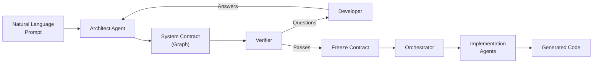

# IterViz

> Visual AI agent orchestrator for software architecture planning — turn a natural language prompt into a verified system design, then watch multiple agents implement it in real-time.

IterViz bridges the gap between high-level software ideas and working code. You describe what you want to build, an Architect agent generates a graph-based system design, a Verifier ensures consistency and completeness through developer Q&A, and then multiple agents implement each component while you watch their progress live.

> **Status:** Active development. Core Phase 1 (planning loop) and Phase 2 (multi-agent implementation) are functional. Implementation subgraphs (M6) are in progress.

---

## What IterViz Does



**Phase 1 — Planning Loop:**
1. Enter a prompt like *"Build a Slack bot that summarizes unread DMs daily"*
2. The Architect agent generates a system graph with nodes (components) and edges (data/control flow)
3. The Verifier checks for consistency, missing details, and unhandled failures
4. Answer clarifying questions to refine the design
5. Iterate until the contract passes verification

**Phase 2 — Implementation:**
1. Freeze the verified contract
2. Multiple agents claim and implement nodes in parallel
3. Watch real-time progress as nodes transition: drafted → in_progress → implemented
4. Download the generated code

---

## Quick Start

### Prerequisites

- **Python 3.10+** (conda recommended)
- **Node.js 18+**
- **API Key:** `ANTHROPIC_API_KEY` or `OPENAI_API_KEY`

### Installation

You'll need **two terminals** — one for the backend, one for the frontend.

**Terminal 1 — Backend:**
```bash
cd backend
pip install -r requirements.txt

# Set your API key
export ANTHROPIC_API_KEY="your-key-here"
# or: export OPENAI_API_KEY="your-key-here"
```

**Terminal 2 — Frontend:**
```bash
cd frontend
npm install
```

### Running

**Terminal 1 — Start backend (port 8000):**
```bash
cd backend
DEBUG=1 uvicorn app.main:app --reload
```

**Terminal 2 — Start frontend (port 5173):**
```bash
cd frontend
npm run dev
```

Open **http://localhost:5173** in your browser.

---

## Demo Walkthrough

### Option 1: Compiler Eval (No UI, tests verification logic)

Run the compiler evaluation harness against 8 seed contracts:

```bash
cd backend

# Parse-only mode (no LLM calls, fast)
python scripts/eval_compiler.py --no-llm

# Full LLM evaluation (requires API key)
python scripts/eval_compiler.py
```

This tests the Verifier's ability to detect invariant violations, missing payloads, orphaned nodes, and other contract issues.

### Option 2: Full Phase 1 + Phase 2 Demo

1. Start both backend and frontend (see Running above)
2. Open http://localhost:5173
3. Enter a prompt:
   ```
   Build a Slack bot that summarizes unread DMs daily
   ```
4. Click **Architect** — watch the system graph appear
5. Click **Verify** — see violations and questions
6. Answer the questions, click **Submit**
7. Repeat Verify → Answer until the contract passes (typically 2-3 iterations)
8. Click **Freeze** to lock the contract
9. Click **Implement** — watch nodes turn yellow (in progress) then green (implemented)
10. Click **Download** to get the generated code

---

## Project Structure

```
IterViz/
├── backend/                    # FastAPI Python backend
│   ├── app/
│   │   ├── api.py              # REST endpoints
│   │   ├── ws.py               # WebSocket for live updates
│   │   ├── architect.py        # Architect agent (prompt → contract)
│   │   ├── compiler.py         # Verifier (contract → violations)
│   │   ├── orchestrator.py     # Phase 2 implementation coordinator
│   │   ├── agents.py           # External agent registry
│   │   ├── assignments.py      # Node assignment tracking
│   │   ├── schemas.py          # Pydantic models
│   │   └── prompts/            # LLM system prompts
│   ├── scripts/
│   │   ├── eval_compiler.py    # Evaluation harness
│   │   └── seed_contracts/     # Test fixtures (8 contracts)
│   └── tests/                  # pytest suite
├── frontend/                   # React + Vite + TypeScript
│   └── src/
│       ├── components/
│       │   ├── Graph.tsx       # React Flow graph renderer
│       │   ├── NodeCard.tsx    # Custom node component
│       │   ├── QuestionPanel.tsx
│       │   ├── ControlBar.tsx
│       │   └── AgentPanel.tsx  # Connected agents display
│       ├── state/
│       │   ├── contract.ts     # Zustand store
│       │   └── websocket.ts    # WS connection manager
│       └── api/
│           └── client.ts       # Backend API wrapper
├── docs/                       # Architecture and configuration docs
└── scripts/
    └── parallel-dev/           # Multi-agent development workflow
```

---

## Configuration

### Environment Variables

| Variable | Description | Default |
|----------|-------------|---------|
| `ANTHROPIC_API_KEY` | Anthropic API key | — |
| `OPENAI_API_KEY` | OpenAI API key | — |
| `GLASSHOUSE_LLM_PROVIDER` | Force provider: `openai` or `anthropic` | Auto-detect |
| `GLASSHOUSE_COMPILER_MODEL` | Override model for Verifier | `claude-opus-4-5` |
| `DEBUG` | Enable verbose logging | `0` |

### LLM Provider Selection

Priority order:
1. Explicit `GLASSHOUSE_LLM_PROVIDER` env var
2. If `ANTHROPIC_API_KEY` is set → use Anthropic
3. If `OPENAI_API_KEY` is set → use OpenAI

---

## Key Concepts

**Contract:** A graph-based representation of a software system. Contains nodes (components), edges (data/control flow), failure scenarios, and decisions.

**Node:** A component in the system — service, store, external API, etc. Has a name, description, responsibilities, confidence score, and implementation status.

**Edge:** A connection between nodes — data flow, control flow, or dependency. Includes payload schema and failure handling.

**Verification:** The Verifier runs multiple passes to check invariants (orphaned nodes, missing payloads, cycles), provenance (who decided what), and failure scenarios.

**UVDC (User-Visible Decision Coverage):** Percentage of load-bearing decisions that have been explicitly confirmed by the user vs. assumed by the agent.

---

## Testing

```bash
cd backend

# Run all tests
pytest tests/ -v

# Run with coverage
pytest tests/ --cov=app --cov-report=term-missing

# Run specific test file
pytest tests/test_compiler.py -v
```

---

## Documentation

| # | Page |
|---|------|
| 1 | [Overview](docs/01-overview.md) |
| 1.1 | [Project Purpose & Goals](docs/01-1-project-purpose-and-goals.md) |
| 1.2 | [Repository Status & Roadmap](docs/01-2-repository-status-and-roadmap.md) |
| 2 | [Architecture](docs/02-architecture.md) |
| 2.1 | [Data Ingestion & Telemetry Collection](docs/02-1-data-ingestion-and-telemetry-collection.md) |
| 2.2 | [Data Transformation & Storage](docs/02-2-data-transformation-and-storage.md) |
| 2.3 | [Rendering Engine & Frontend UI](docs/02-3-rendering-engine-and-frontend-ui.md) |
| 3 | [Configuration](docs/03-configuration.md) |
| 3.1 | [Configuration Schema Reference](docs/03-1-configuration-schema-reference.md) |
| 3.2 | [Usage Examples & Integration Guide](docs/03-2-usage-examples-and-integration-guide.md) |
| 5 | [Glossary](docs/05-glossary.md) |

---

## Roadmap

See [TODO.md](TODO.md) for detailed milestone breakdown.

| Milestone | Description | Status |
|-----------|-------------|--------|
| M0 | Static React Flow mockup | Done |
| M1 | Compiler tuning harness | Done |
| M2 | Architect agent + contract I/O | Done |
| M3 | Phase 1 loop end-to-end | Done |
| M4 | Editable graph + decision provenance | Done |
| M5 | Phase 2 orchestrator | Done |
| M6 | Implementation subgraphs + polish | In Progress |

---

## License

TBD.
