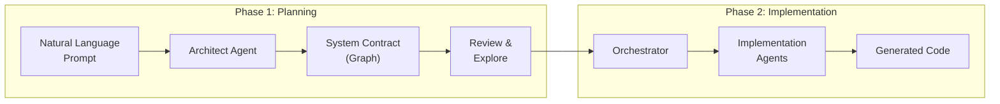

# IterViz

> Visual AI agent orchestrator for software architecture planning — turn a natural language prompt into a system design, then watch multiple agents implement it in real-time.

IterViz bridges the gap between high-level software ideas and working code. You describe what you want to build, an Architect agent generates a graph-based system design, and then you can drill down into each component to see implementation details. Multiple agents can then implement each component while you watch their progress live.

---

## Terminology

**Contract:** A graph-based representation of a software system. Contains nodes (components), edges (data/control flow), and implementation status.

**Node:** A component in the system — service, store, external API, etc. Has a name, description, responsibilities, and implementation status.

**Edge:** A connection between nodes — data flow, control flow, or dependency. Includes payload schema and failure handling.

**Subgraph:** A detailed breakdown of implementation tasks for a single node. Each subgraph contains functions, tests, types, and other artifacts needed to implement the component.

---

## What IterViz Does



**Phase 1 — Planning:**
1. Enter a prompt like *"Build a Slack bot that summarizes unread DMs daily"*
2. The Architect agent generates a system graph with nodes (components) and edges (data/control flow)
3. Click on any node to see its implementation subgraph — a breakdown of the functions, tests, and types needed
4. Review the architecture and explore component details

**Phase 2 — Implementation:**
1. Click "Implement" to start the implementation process
2. Multiple agents claim and implement nodes in parallel
3. Watch real-time progress as nodes transition: drafted → in_progress → implemented
4. Download the generated code

---

## Quick Start

### Prerequisites

- **Python 3.10+** (via conda)
- **Node.js 18+**
- **API Key:** `ANTHROPIC_API_KEY` or `OPENAI_API_KEY`

### Installation

You'll need **two terminals** — one for the backend, one for the frontend.

**Terminal 1 — Backend:**
```bash
# Create and activate conda environment
conda create -n iterviz python=3.10 -y
conda activate iterviz

# Install dependencies
cd backend
pip install -r requirements.txt

# Set your API key
export ANTHROPIC_API_KEY="your-key-here"
# or: export OPENAI_API_KEY="your-key-here"
```

**Terminal 2 — Frontend:**

Install Node.js 
```bash
# Install dependencies
cd frontend
npm install
```

### Running

**Terminal 1 — Start backend (port 8000):**
```bash
conda activate iterviz
cd backend
DEBUG=1 uvicorn app.main:app --reload --reload-dir app
```

> **Note:** The `--reload-dir app` flag is important! It tells uvicorn to only watch the `app/` folder, ignoring the `generated/` folder where code is written during implementation.

**Terminal 2 — Start frontend (port 5173):**
```bash
cd frontend
npm run dev
```

Open **http://localhost:5173** in your browser.

---

## Project Structure

```
IterViz/
├── backend/                    # FastAPI Python backend
│   ├── app/
│   │   ├── api.py              # REST endpoints
│   │   ├── ws.py               # WebSocket for live updates
│   │   ├── architect.py        # Architect agent (prompt → contract)
│   │   ├── subgraph.py         # Subgraph generation (node → tasks)
│   │   ├── orchestrator.py     # Phase 2 implementation coordinator
│   │   ├── agents.py           # External agent registry
│   │   ├── assignments.py      # Node assignment tracking
│   │   ├── schemas.py          # Pydantic models
│   │   └── prompts/            # LLM system prompts
│   ├── scripts/
│   │   └── seed_contracts/     # Test fixtures
│   └── tests/                  # pytest suite
├── frontend/                   # React + Vite + TypeScript
│   └── src/
│       ├── components/
│       │   ├── Graph.tsx       # React Flow graph renderer
│       │   ├── NodeCard.tsx    # Custom node component
│       │   ├── SubgraphView.tsx # Implementation subgraph view
│       │   ├── InfoPanel.tsx   # Planning info & task details
│       │   ├── ControlBar.tsx
│       │   └── AgentPanel.tsx  # Connected agents display
│       ├── state/
│       │   ├── contract.ts     # Zustand store
│       │   ├── subgraph.ts     # Subgraph store
│       │   └── websocket.ts    # WS connection manager
│       └── api/
│           └── client.ts       # Backend API wrapper
├── docs/                       # Architecture and configuration docs
└── scripts/
    └── parallel-dev/           # Multi-agent development workflow
```

---

## Configuration

### Environment Variables

| Variable | Description | Default |
|----------|-------------|---------|
| `ANTHROPIC_API_KEY` | Anthropic API key | — |
| `OPENAI_API_KEY` | OpenAI API key | — |
| `ITERVIZ_LLM_PROVIDER` | Force provider: `openai` or `anthropic` | Auto-detect |
| `ITERVIZ_ARCHITECT_MODEL` | Override model for Architect | `claude-opus-4-5` |
| `DEBUG` | Enable verbose logging | `0` |

### LLM Provider Selection

Priority order:
1. Explicit `ITERVIZ_LLM_PROVIDER` env var
2. If `ANTHROPIC_API_KEY` is set → use Anthropic
3. If `OPENAI_API_KEY` is set → use OpenAI

---

## Documentation

| # | Page |
|---|------|
| 1 | [Overview](docs/01-overview.md) |
| 1.1 | [Project Purpose & Goals](docs/01-1-project-purpose-and-goals.md) |
| 1.2 | [Repository Status & Roadmap](docs/01-2-repository-status-and-roadmap.md) |
| 2 | [Architecture](docs/02-architecture.md) |
| 2.1 | [Data Ingestion & Telemetry Collection](docs/02-1-data-ingestion-and-telemetry-collection.md) |
| 2.2 | [Data Transformation & Storage](docs/02-2-data-transformation-and-storage.md) |
| 2.3 | [Rendering Engine & Frontend UI](docs/02-3-rendering-engine-and-frontend-ui.md) |
| 3 | [Configuration](docs/03-configuration.md) |
| 3.1 | [Configuration Schema Reference](docs/03-1-configuration-schema-reference.md) |
| 3.2 | [Usage Examples & Integration Guide](docs/03-2-usage-examples-and-integration-guide.md) |
| 5 | [Glossary](docs/05-glossary.md) |

---

## License

TBD.
