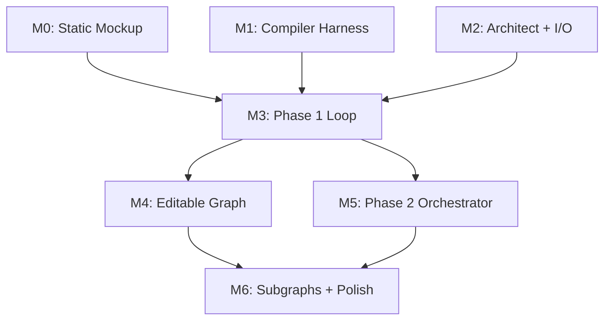

# TODO.md — Glasshouse Build Milestones

This document breaks the project into concrete milestones, each with a clear acceptance test. Milestones are sequenced to derisk the hardest parts early (UI layout, Compiler prompt tuning) before wiring the full loop.

See [SPEC.md](SPEC.md) for product requirements and [ARCHITECTURE.md](ARCHITECTURE.md) for system design.

---

## Milestone Overview

| ID | Name | Key Deliverable | Risk Level |
|----|------|-----------------|------------|
| M0 | Static React Flow mockup | Hardcoded UI renders without overlap | Low |
| M1 | Compiler tuning harness | Eval script + prompt v1 with ≥80% recall | Medium |
| M2 | Architect agent + contract I/O | `POST /sessions` returns valid contract | Medium |
| M3 | Phase 1 loop end-to-end | Demo prompt converges in ≤3 iterations | High |
| M4 | Editable graph + decision provenance | User edits flow back with `decided_by: user` | Medium |
| M5 | Phase 2 orchestrator (slim) | 2-3 generated files match frozen contract | High |
| M6 | Implementation subgraphs + polish | Live subgraph progress visualization; 3-minute demo | Medium |

---

## M0 — Static React Flow Mockup

**Goal**: Prove the visualization layer works before any backend exists. Validate that dagre layout produces non-overlapping, readable graphs for contracts of varying sizes.

### Tasks

- [ ] Initialize React + Vite + TypeScript project in `frontend/`.
- [ ] Install dependencies: `reactflow`, `dagre`, `tailwindcss`, `zustand`.
- [ ] Create `public/sample_contract_small.json` (4 nodes, 5 edges) — a simple CLI tool.
- [ ] Create `public/sample_contract_medium.json` (8 nodes, 12 edges) — a web app with auth, DB, external API.
- [ ] Implement `Graph.tsx`:
  - Load contract JSON from `public/`.
  - Convert `nodes[]` and `edges[]` to React Flow format.
  - Apply dagre layout with `rankdir: 'TB'`, `nodesep: 80`, `ranksep: 100`.
  - Render with React Flow's `<ReactFlow>` component.
- [ ] Implement `NodeCard.tsx` (custom node renderer):
  - Display `name` as header.
  - Display `kind` as icon or badge.
  - Display `status` as colored badge (gray=drafted, yellow=in_progress, green=implemented).
  - Display `confidence` as a horizontal bar (red < 0.5, yellow 0.5-0.8, green > 0.8).
  - Display first assumption text (truncated).
  - Click to expand full details (all assumptions, responsibilities, open questions).
- [ ] Implement `EdgeLabel.tsx`:
  - Show `kind` on hover.
  - Show `payload_schema` summary (e.g., "object with 3 fields") on hover.
- [ ] Add a dropdown to switch between small and medium sample contracts.
- [ ] Style with Tailwind: dark background, light nodes, clear visual hierarchy.

### Acceptance Test

1. Run `npm run dev` in `frontend/`.
2. Open `http://localhost:5173`.
3. Small contract renders with no overlapping nodes.
4. Medium contract renders with no overlapping nodes.
5. Nodes are readable; confidence bars display correctly.
6. Switching contracts re-renders without page refresh.

### Deliverables

- `frontend/` directory with working React app.
- `public/sample_contract_small.json`
- `public/sample_contract_medium.json`

---

## M1 — Compiler Tuning Harness

**Goal**: Build an isolated eval script to iterate on the Blind Compiler's system prompt without the full backend. Establish a baseline for violation detection before wiring the loop.

### Tasks

- [ ] Initialize Python project in `backend/` with `pyproject.toml` or `requirements.txt`.
- [ ] Install dependencies: `openai`, `anthropic`, `instructor`, `pydantic`, `pytest`, `pytest-cov`.
- [ ] Create `app/logger.py` — structured logging with DEBUG mode support.
  - `get_logger(name)` function returning configured logger.
  - JSON-formatted output for easy parsing.
  - `DEBUG=1` environment variable enables verbose logging.
- [ ] Create `app/prompts/compiler.md` — initial system prompt for Blind Compiler.
  - Explicitly state: "You have NOT seen the user's original prompt."
  - Define the four verification passes.
  - Include 2-3 few-shot examples of contract → violations.
- [ ] Create `app/schemas.py` — Pydantic models for:
  - `Contract` (matching ARCHITECTURE.md §4)
  - `Violation` (type, severity, message, affects, suggested_question)
  - `CompilerOutput` (verdict, violations, questions, intent_guess)
- [ ] Create `app/llm.py` — thin wrapper using `instructor`:
  - `def call_compiler(contract: Contract) -> CompilerOutput`
  - Use `response_model=CompilerOutput` for structured output.
  - Set `temperature=0`.
  - Log all LLM calls with timing and token counts.
- [ ] Create `scripts/seed_contracts/` with 6-10 test contracts:
  - `valid_simple.json` — should pass with 0 violations.
  - `orphaned_node.json` — one node has no edges.
  - `missing_payload.json` — data edge has no `payload_schema`.
  - `silent_db_choice.json` — node has `decided_by: agent` on a load-bearing field.
  - `unhandled_failure.json` — external edge with no failure handler.
  - `intent_mismatch.json` — graph structure implies different intent than `stated_intent`.
  - `low_confidence_no_question.json` — node with confidence < 0.6 but empty `open_questions`.
  - `cycle_in_data_edges.json` — cyclic dependency among data edges.
- [ ] Create `scripts/eval_compiler.py`:
  - Load each seed contract.
  - Call `call_compiler()`.
  - Compare emitted violations against expected violations (defined in a sidecar `_expected.json`).
  - Print pass/fail per contract.
  - Print aggregate recall and precision.
- [ ] Iterate on `compiler.md` until:
  - Recall ≥ 80% (catches 80% of seeded violations).
  - Precision ≥ 90% (90% of emitted violations are true positives).
  - Questions are actionable (manual review).

### Unit Tests (run with `pytest`)

- [ ] Create `tests/conftest.py` with shared fixtures:
  - `sample_valid_contract` — loads a known-good contract.
  - `sample_invalid_contracts` — dict of contracts with specific violations.
  - `mock_llm_client` — returns canned responses for deterministic tests.
- [ ] Create `tests/test_schemas.py`:
  - Test that valid contract JSON parses successfully.
  - Test that invalid JSON raises `ValidationError` with clear message.
  - Test that load-bearing fields require `decided_by`.
  - Test edge cases: empty nodes list, missing required fields, invalid enum values.

### Acceptance Test

1. Run `python scripts/eval_compiler.py`.
2. Script completes without errors.
3. Output shows ≥ 80% recall, ≥ 90% precision.
4. `valid_simple.json` passes with 0 violations.
5. Each invalid contract triggers at least one expected violation.

### Deliverables

- `backend/app/prompts/compiler.md` (tuned prompt)
- `backend/app/schemas.py`
- `backend/app/llm.py`
- `backend/app/logger.py`
- `backend/scripts/seed_contracts/*.json`
- `backend/scripts/eval_compiler.py`
- `backend/tests/conftest.py`
- `backend/tests/test_schemas.py`

---

## M2 — Architect Agent + Contract I/O

**Goal**: Implement the Architect agent that converts a user prompt into a valid contract, and persist contracts to SQLite.

### Tasks

- [ ] Create `app/prompts/architect.md` — system prompt for Architect.
  - Input: user prompt + optional previous contract + user answers.
  - Output: full `Contract` JSON.
  - Include 2-3 few-shot examples.
- [ ] Create `app/architect.py`:
  - `def generate_contract(prompt: str) -> Contract`
  - `def refine_contract(contract: Contract, answers: list[Decision]) -> Contract`
  - Use `instructor` with `response_model=Contract`.
- [ ] Create `app/contract.py`:
  - SQLite table: `sessions (id, created_at, contract_json, status)`.
  - `def create_session(prompt: str) -> Session`
  - `def get_session(id: str) -> Session`
  - `def update_contract(id: str, contract: Contract) -> None`
  - JSON schema validation on every write.
- [ ] Create `app/api.py` with FastAPI routes:
  - `POST /api/v1/sessions` — create session, call Architect, return contract.
  - `GET /api/v1/sessions/{id}` — return current contract.
  - Add structured logging to all endpoints.
- [ ] Create `app/main.py`:
  - FastAPI app factory.
  - CORS middleware (allow localhost:5173).
  - Include `api.py` router.
  - Request logging middleware (log method, path, duration, status).

### Unit Tests (run with `pytest`)

- [ ] Create `tests/test_contract.py`:
  - Test `create_session()` returns valid session with UUID.
  - Test `get_session()` retrieves persisted contract.
  - Test `update_contract()` updates and persists changes.
  - Test version increments on each update.
  - Test invalid contract JSON is rejected with clear error.
- [ ] Create `tests/test_architect.py`:
  - Test `generate_contract()` with mocked LLM returns valid structure.
  - Test `refine_contract()` merges answers correctly.
  - Test that all nodes have required fields.
  - Test that edges reference valid node IDs.
- [ ] Create `tests/test_api.py`:
  - Test `POST /sessions` returns 201 with valid contract.
  - Test `GET /sessions/{id}` returns 200 with contract.
  - Test `GET /sessions/{invalid_id}` returns 404.
  - Test malformed request body returns 422.

### Acceptance Test

1. Run `pytest tests/ -v` — all tests pass.
2. Run `uvicorn app.main:app --reload`.
3. `curl -X POST http://localhost:8000/api/v1/sessions -H "Content-Type: application/json" -d '{"prompt": "Build a TODO app with user auth"}'`
4. Response is valid JSON matching `Contract` schema.
5. Contract has ≥ 3 nodes, ≥ 2 edges.
6. `GET /api/v1/sessions/{id}` returns the same contract.
7. Run `DEBUG=1 uvicorn app.main:app` — logs show LLM call timing.

### Deliverables

- `backend/app/prompts/architect.md`
- `backend/app/architect.py`
- `backend/app/contract.py`
- `backend/app/api.py`
- `backend/app/main.py`
- `backend/tests/test_contract.py`
- `backend/tests/test_architect.py`
- `backend/tests/test_api.py`

---

## M3 — Phase 1 Loop End-to-End

**Goal**: Wire the full Architect ↔ Compiler ↔ Q&A loop. Frontend renders contract, displays Compiler questions, posts answers, and re-renders updated contract.

### Tasks

- [ ] Create `app/compiler.py`:
  - `def verify_contract(contract: Contract) -> CompilerOutput`
  - Run invariant checks (deterministic Python, not LLM) for INV-001 through INV-007.
  - Call LLM for intent reconstruction + provenance + failure-scenario passes.
  - Merge violations, rank, emit top 5 questions.
- [ ] Add API routes in `app/api.py`:
  - `POST /api/v1/sessions/{id}/compiler/verify` — run Compiler, return violations + questions.
  - `POST /api/v1/sessions/{id}/answers` — record answers in `decisions[]`, return updated contract.
  - `POST /api/v1/sessions/{id}/architect/refine` — pass answers to Architect, return updated contract.
- [ ] Update `contract.py`:
  - Add `decisions[]` to contract.
  - Add `verification_log[]` to contract.
  - Implement `add_decision()` and `add_verification_run()`.
- [ ] Frontend: wire to live backend (replace hardcoded JSON):
  - `src/api/client.ts` — fetch wrappers for all endpoints.
  - `src/state/contract.ts` — Zustand store for contract, violations, questions.
  - `src/components/PromptInput.tsx` — textarea + "Architect" button → `POST /sessions`.
  - `src/components/ControlBar.tsx` — "Verify" button → `POST /compiler/verify`.
  - `src/components/QuestionPanel.tsx`:
    - List questions with affected node/edge highlighted.
    - Answer textarea per question.
    - "Submit Answers" → `POST /answers` then `POST /architect/refine`.
  - After refine, re-fetch contract and re-render graph.
- [ ] Implement visual diff: highlight nodes/edges that changed since last Compiler run.
- [ ] Add comprehensive logging throughout the Phase 1 loop:
  - Log each Compiler pass with timing.
  - Log violation counts and types.
  - Log question generation.
  - Log contract diffs on each update.

### Unit Tests (run with `pytest`)

- [ ] Create `tests/test_compiler.py`:
  - Test each invariant check (INV-001 through INV-007) individually:
    - Test orphaned node detection.
    - Test unconsumed output detection.
    - Test missing payload schema detection.
    - Test low confidence + no question detection.
    - Test cyclic data dependency detection.
  - Test that valid contracts pass all invariants.
  - Test violation ranking (error > warning).
  - Test question cap (max 5 questions).
  - Test UVDC calculation.
- [ ] Update `tests/test_api.py`:
  - Test `POST /compiler/verify` returns violations for invalid contract.
  - Test `POST /compiler/verify` returns empty violations for valid contract.
  - Test `POST /answers` records decisions correctly.
  - Test `POST /architect/refine` updates contract with answers.
- [ ] Create `tests/test_phase1_loop.py` (integration):
  - Test full loop with mocked LLM converges in ≤ 3 iterations.
  - Test that answered questions don't reappear.

### E2E Test (manual, with canned prompt)

- [ ] Test with canned prompt: "Build a Slack bot that summarizes unread DMs daily."
  - Verify Compiler emits violations on first run.
  - Answer questions.
  - Verify contract updates.
  - Loop until Compiler passes (≤ 3 iterations).

### Acceptance Test

1. Run `pytest tests/ -v` — all tests pass.
2. Start backend (`DEBUG=1 uvicorn`) and frontend (`npm run dev`).
3. Paste canned prompt, click Architect.
4. Graph renders with ≥ 4 nodes.
5. Click Verify; QuestionPanel shows 3-5 questions.
6. Logs show Compiler timing and violation details.
7. Answer one question; click Submit.
8. Graph updates; changed nodes highlighted.
9. Repeat Verify + Answer until Compiler passes (0 violations).
10. Total iterations ≤ 3.

### Deliverables

- `backend/app/compiler.py`
- Updated `backend/app/api.py`
- Updated `backend/app/contract.py`
- `backend/tests/test_compiler.py`
- `backend/tests/test_phase1_loop.py`
- `frontend/src/api/client.ts`
- `frontend/src/state/contract.ts`
- `frontend/src/components/PromptInput.tsx`
- `frontend/src/components/ControlBar.tsx`
- `frontend/src/components/QuestionPanel.tsx`
- Updated `frontend/src/components/Graph.tsx` (diff highlighting)

---

## M4 — Editable Graph + Decision Provenance

**Goal**: Allow users to directly edit node fields in the graph. Edits are tagged `decided_by: user` and flow back to the backend.

### Tasks

- [ ] Update `NodeCard.tsx`:
  - Make `description`, `responsibilities`, `assumptions` fields inline-editable (click to edit, blur to save).
  - On edit, call `PATCH` endpoint (or batch edits on "Save" button).
- [ ] Add API route:
  - `PATCH /api/v1/sessions/{id}/nodes/{node_id}` — update node fields, set `decided_by: user` on changed fields.
  - Validate that structural fields (`id`, `kind`) cannot be changed by user (or flag as user-decided).
- [ ] Update `contract.py`:
  - `update_node()` function that merges user edits and sets provenance.
- [ ] Update `Graph.tsx`:
  - Highlight user-edited fields with a different color (blue border).
  - Diff view: toggle to show "what changed since last Compiler run" vs. "what user edited vs. agent."
- [ ] Update Compiler:
  - Respect `decided_by: user` — do not generate questions for user-decided fields.
  - UVDC calculation: count user-decided fields as covered.
  - Log provenance checks with field-level detail.

### Unit Tests (run with `pytest`)

- [ ] Update `tests/test_contract.py`:
  - Test `update_node()` sets `decided_by: user` on changed fields.
  - Test `update_node()` preserves unchanged fields' provenance.
  - Test that structural fields (`id`, `kind`) reject user edits (or flag appropriately).
- [ ] Update `tests/test_compiler.py`:
  - Test that `decided_by: user` fields don't generate violations.
  - Test that `decided_by: agent` load-bearing fields generate violations.
  - Test UVDC calculation with mixed provenance.
- [ ] Update `tests/test_api.py`:
  - Test `PATCH /nodes/{id}` updates fields and sets provenance.
  - Test `PATCH /nodes/{id}` with invalid node_id returns 404.
  - Test `PATCH /nodes/{id}` with invalid field values returns 422.

### E2E Test (manual)

- [ ] Test provenance flow:
  - Generate contract.
  - User edits one node's description.
  - Run Verify.
  - Compiler does not question the user-edited field.
  - UVDC increases.

### Acceptance Test

1. Run `pytest tests/ -v` — all tests pass.
2. Generate contract from prompt.
3. Click a node's description field, edit it, blur.
4. Field shows blue border (user-edited).
5. Click Verify.
6. Compiler output does not include a question about the edited field.
7. UVDC score (displayed in UI) reflects the user edit.
8. Logs show provenance tracking for each field.

### Deliverables

- Updated `frontend/src/components/NodeCard.tsx` (inline editing)
- `PATCH /api/v1/sessions/{id}/nodes/{node_id}` endpoint
- Updated `backend/app/contract.py`
- Updated `backend/app/compiler.py` (provenance-aware)
- Updated `frontend/src/components/Graph.tsx` (provenance highlighting)
- Updated `backend/tests/test_contract.py`
- Updated `backend/tests/test_compiler.py`
- Updated `backend/tests/test_api.py`

---

## M5 — Phase 2 Orchestrator (Slim Demo Path)

**Goal**: Implement the freeze → implement → live-update flow. Support both internal subagents and external agent coordination. UI shows live node status transitions as agents work.

### Tasks

- [ ] Add API routes:
  - `POST /api/v1/sessions/{id}/freeze` — lock contract, set status to `verified`, compute hash.
  - `POST /api/v1/sessions/{id}/implement` — start Phase 2 (supports `mode: "internal" | "external"`).
  - `GET /api/v1/sessions/{id}/generated` — return zip of generated files + final contract.
- [ ] Create `app/orchestrator.py`:
  - `def freeze_contract(session_id: str) -> Contract`
  - `def create_assignments(session_id: str) -> list[Assignment]` — create assignment for each leaf node
  - `def run_implementation(session_id: str, mode: str) -> None` (async, runs in background)
    - Identify leaf nodes.
    - Create assignments with frozen snapshot + node + neighbor interfaces.
    - **Internal mode**: For each assignment, spawn LLM subagent sequentially.
    - **External mode**: Mark assignments as available; wait for external agents to claim and complete.
    - Broadcast `node_status_changed` via WebSocket on each transition.
  - `def run_integration_pass(session_id: str) -> list[Mismatch]`
    - Compare actual interfaces against declared payload schemas.
    - Return mismatches (surfaced as violations, not auto-fixed).
- [ ] Create `app/prompts/subagent.md`:
  - Input: node, neighbor interfaces.
  - Output: file contents + `implementation` block.
  - Emphasize: "Code against the declared interfaces, not your assumptions."
- [ ] Create `app/prompts/integrator.md`:
  - Input: full contract with implementations.
  - Output: list of mismatches.
- [ ] Create `app/ws.py`:
  - WebSocket endpoint `/api/v1/sessions/{id}/stream`.
  - Connection manager: track active connections per session.
  - Broadcast function: send JSON message to all connections for a session.
  - Support new message types: `node_claimed`, `node_progress`, `agent_connected`.
- [ ] Create `generated/` directory (gitignored).
- [ ] Add comprehensive logging for Phase 2:
  - Log freeze operation with hash.
  - Log each subagent dispatch with node details.
  - Log subagent completion with timing and file paths.
  - Log integration pass results.
  - Log WebSocket broadcasts.

### External Agent Coordination (core feature)

- [ ] Add external agent API routes:
  - `POST /api/v1/agents` — register external agent, return `agent_id`.
  - `GET /api/v1/agents` — list registered agents with status.
  - `GET /api/v1/sessions/{id}/assignments?agent_id=X` — poll for assignment.
  - `POST /api/v1/sessions/{id}/nodes/{node_id}/claim` — claim node, set status to `in_progress`.
  - `POST /api/v1/sessions/{id}/nodes/{node_id}/status` — report progress (optional).
  - `POST /api/v1/sessions/{id}/nodes/{node_id}/implementation` — submit implementation.
  - `POST /api/v1/sessions/{id}/nodes/{node_id}/release` — release claim on failure.
- [ ] Create `app/agents.py`:
  - `Agent` model: id, name, type, registered_at, last_seen_at, status.
  - SQLite table for agent registry.
  - `def register_agent(name, type) -> Agent`
  - `def get_agent(agent_id) -> Agent`
  - `def heartbeat(agent_id)` — update last_seen_at.
- [ ] Create `app/assignments.py`:
  - `Assignment` model: id, session_id, node_id, assigned_to, assigned_at, status.
  - `def create_assignment(session_id, node_id, payload) -> Assignment`
  - `def claim_assignment(assignment_id, agent_id) -> Assignment`
  - `def get_available_assignments(session_id) -> list[Assignment]`
- [ ] Frontend updates for external agent visibility:
  - `NodeCard.tsx` — show agent name/icon when node is claimed by external agent.
  - `AgentPanel.tsx` (new) — side panel showing connected agents and their assigned nodes.
  - Handle `agent_connected`, `node_claimed`, `node_progress` WebSocket messages.
  - Visual indicator for "waiting for external agents" vs "internal processing".

### Frontend (common)

- [ ] `src/state/websocket.ts` — connect to WS on session load; handle all message types.
- [ ] Update `contract.ts` store on WS messages.
- [ ] `ControlBar.tsx` — "Freeze" and "Implement" buttons; mode selector (internal/external).
- [ ] `NodeCard.tsx` — animate status badge transitions (drafted → in_progress → implemented).
- [ ] Add "Download" button that fetches `/generated` zip.

### Unit Tests (run with `pytest`)

- [ ] Create `tests/test_orchestrator.py`:
  - Test `freeze_contract()` sets status, computes hash, prevents further edits.
  - Test leaf node identification (nodes with no outgoing data/control edges).
  - Test append-only enforcement (subagent can't modify other nodes).
  - Test integration mismatch detection (actual vs declared interface).
  - Test that frozen contracts reject structural changes.
  - Test assignment creation for all leaf nodes.
- [ ] Create `tests/test_agents.py`:
  - Test agent registration returns valid agent_id.
  - Test agent listing shows all registered agents.
  - Test heartbeat updates last_seen_at.
  - Test agent status transitions (active → idle → disconnected).
- [ ] Create `tests/test_assignments.py`:
  - Test assignment creation with correct payload.
  - Test claim assignment sets assigned_to and broadcasts.
  - Test double-claim returns error (node already claimed).
  - Test release assignment makes node available again.
  - Test get_available_assignments excludes claimed nodes.
- [ ] Create `tests/test_ws.py`:
  - Test WebSocket connection lifecycle.
  - Test broadcast sends to all connected clients.
  - Test message format matches schema.
  - Test reconnection handling.
  - Test `node_claimed`, `node_progress` message types.
- [ ] Update `tests/test_api.py`:
  - Test `POST /freeze` changes status and returns hash.
  - Test `POST /freeze` on already-frozen contract returns error.
  - Test `POST /implement` returns job_id and starts background task.
  - Test `POST /implement` with mode=external creates assignments.
  - Test `GET /generated` returns zip with correct structure.
  - Test `GET /generated` before implementation returns 404.
  - Test external agent endpoints (register, claim, status, implementation).

### E2E Test (manual, with canned prompt)

- [ ] Test Phase 2 flow (internal mode):
  - Complete Phase 1 (contract passes).
  - Click Freeze.
  - Click Implement (internal mode).
  - Watch nodes turn yellow then green.
  - Click Download; zip contains 2-3 .py files + contract.json.

- [ ] Test Phase 2 flow (external mode):
  - Complete Phase 1 (contract passes).
  - Click Freeze.
  - Click Implement (external mode).
  - Nodes show as "waiting for agent".
  - In separate terminal, run external agent script that:
    - Registers via `POST /agents`.
    - Polls `GET /assignments`.
    - Claims node via `POST /nodes/{id}/claim`.
    - Submits implementation via `POST /nodes/{id}/implementation`.
  - Watch node turn yellow (claimed) then green (implemented) in UI.
  - Verify agent name appears on node card.

### Acceptance Test

1. Run `pytest tests/ -v` — all tests pass.
2. Complete Phase 1 loop (contract verified).
3. Click Freeze; contract status changes to `verified`; Freeze button disables.
4. Click Implement; nodes start transitioning (live in UI via WebSocket).
5. Within 60 seconds, all nodes reach `implemented`.
6. Logs show subagent dispatch, completion, and integration pass.
7. Click Download; zip file downloads.
8. Unzip contains:
   - `contract.json` (final, with `implementation` blocks filled).
   - `<node_id>/` directories with `.py` files.
9. File interfaces (function signatures) match declared `payload_schema` (manual inspection).

### Deliverables

- `backend/app/orchestrator.py`
- `backend/app/agents.py`
- `backend/app/assignments.py`
- `backend/app/prompts/subagent.md`
- `backend/app/prompts/integrator.md`
- `backend/app/ws.py`
- Updated `backend/app/api.py` (freeze, implement, generated, agent endpoints)
- `backend/tests/test_orchestrator.py`
- `backend/tests/test_agents.py`
- `backend/tests/test_assignments.py`
- `backend/tests/test_ws.py`
- `frontend/src/state/websocket.ts`
- `frontend/src/components/AgentPanel.tsx`
- Updated `frontend/src/components/ControlBar.tsx`
- Updated `frontend/src/components/NodeCard.tsx` (status animation, agent display)
- `scripts/external_agent_example.py` (reference implementation for external agents)

---

## M6 — Polish + Stretch

**Goal**: Demo-ready polish, including Implementation Subgraphs for live progress visualization. Stretch goals if time permits.

### Implementation Subgraphs (core feature)

When parallel agents implement nodes from the big picture graph, generate **implementation subgraphs** that show a detailed breakdown of implementation tasks. See [docs/02-4-implementation-subgraphs.md](docs/02-4-implementation-subgraphs.md) for full specification.

**Backend:**
- [ ] Create `app/subgraph.py` — Subgraph generation using LLM planner (no verification loop needed; parent node is verified)
- [ ] Create `app/subgraphs.py` — In-memory storage for subgraphs
- [ ] Create `app/prompts/planner.md` — System prompt for implementation planner
- [ ] Add subgraph models to `app/schemas.py`:
  - `SubgraphNode` (function, test_unit, test_integration, type_def, config, error_handler, util kinds)
  - `SubgraphEdge` (dependency relationships)
  - `ImplementationSubgraph` (container with progress tracking)
- [ ] Add API routes:
  - `POST /sessions/{id}/nodes/{node_id}/subgraph` — Generate subgraph for node
  - `GET /sessions/{id}/nodes/{node_id}/subgraph` — Get existing subgraph
  - `GET /sessions/{id}/subgraphs` — Get all subgraphs for session
  - `PATCH /sessions/{id}/nodes/{node_id}/subgraph/nodes/{sg_id}` — Update subgraph node status
- [ ] Add WebSocket broadcasts: `subgraph_created`, `subgraph_node_status_changed`
- [ ] Integrate with `orchestrator.py` to generate subgraphs when implementation starts

**Frontend:**
- [ ] Create `src/types/subgraph.ts` — TypeScript types
- [ ] Create `src/state/subgraph.ts` — Zustand store for subgraph state
- [ ] Create `src/components/SubgraphView.tsx` — Subgraph visualization with dagre layout
- [ ] Create `src/components/SubgraphNodeCard.tsx` — Custom node renderer with status colors:
  - Pending: gray fill, dashed border
  - In progress: yellow fill, solid border, pulse animation
  - Completed: green fill, solid border
  - Failed: red fill, solid border
- [ ] Create `src/components/DraggablePopup.tsx` — Draggable/movable popup component
- [ ] Create `src/components/NodePopupManager.tsx` — Manage popup state with constraints:
  - Allow simultaneous popups for big picture + subgraph node
  - No two nodes from same graph can have popups open at same time
- [ ] Update `NodeCard.tsx`:
  - Left-click on node → enter subgraph view
  - Top-right info button → popup showing description WITHOUT assumptions
- [ ] Update `Graph.tsx` — Integrate subgraph navigation with back arrow
- [ ] Update `websocket.ts` — Handle subgraph WebSocket events

**Tests:**
- [ ] Create `tests/test_subgraph.py` — Subgraph generation tests
- [ ] Create `tests/test_subgraph_api.py` — API endpoint tests

### Core polish (required for demo)

- [ ] Error handling: display LLM errors gracefully in UI (not silent failures).
- [ ] Loading states: spinners during Architect/Compiler/Implement calls.
- [ ] UVDC display: show "User-Visible Decision Coverage: X%" in UI after each Verify.
- [ ] Replay mode: `--replay <trace.json>` flag on backend for deterministic demo.
- [ ] Record a trace: run the demo once, capture all LLM responses to `scripts/replays/demo.json`.
- [ ] README update: setup instructions, demo script, screenshots.
- [ ] Final test coverage report: run `pytest --cov=app --cov-report=html` and verify ≥ 80% coverage.

### Final Test Suite (required before demo)

- [ ] Run full test suite: `pytest tests/ -v` — all tests pass.
- [ ] Run coverage check: `pytest --cov=app --cov-report=term-missing` — ≥ 80% line coverage.
- [ ] Run E2E smoke test with replay: `DEBUG=1 pytest tests/test_e2e.py --replay` — passes deterministically.
- [ ] Create `tests/test_e2e.py`:
  - Test full Phase 1 + Phase 2 flow with mocked LLM.
  - Verify final contract has UVDC = 1.0.
  - Verify generated files exist and have expected structure.
- [ ] Manual QA checklist:
  - [ ] Fresh install works (`pip install -e .` + `npm install`).
  - [ ] All buttons have loading states.
  - [ ] Error messages are user-friendly.
  - [ ] Logs are readable in DEBUG mode.
  - [ ] Demo script runs in < 3 minutes.

### Stretch goals (time permitting)

- [ ] Recursive decomposition: if a node has > 5 responsibilities, prompt user to decompose; instantiate child contract.
- [ ] Failure-scenario badges: show red warning icon on edges with unhandled failure scenarios.
- [ ] Parallel subagent dispatch: run subagents concurrently (asyncio.gather) instead of sequentially.
- [ ] Edge editing: allow user to edit `payload_schema` inline.
- [ ] Export to Mermaid: button to export current graph as Mermaid diagram for docs.
- [ ] CI setup: GitHub Actions workflow for automated testing on push.

### Acceptance Test (demo script)

Run the 3-minute demo script from [SPEC.md §7](SPEC.md):

| Time | Expected |
|------|----------|
| 0:00 | Prompt submitted |
| 0:15 | Graph appears |
| 0:30 | 3 violations visible |
| 0:45 | Q1 answered, badge clears |
| 1:00 | Q2 answered |
| 1:15 | Q3 answered, Compiler passes |
| 1:30 | Freeze + Implement clicked |
| 2:00 | First node green |
| 2:30 | All nodes green |
| 2:45 | Download works |
| 3:00 | UVDC = 1.0 displayed |

Demo runs end-to-end without intervention or errors.

### Subgraph Acceptance Test

| Action | Expected |
|--------|----------|
| Start Phase 2 implementation | Subgraphs generated for each node |
| View implementing node | Subgraph shows with gray pending nodes |
| Agent starts work | Current subgraph node turns yellow with pulse |
| Agent completes task | Subgraph node turns green with solid border |
| Click back arrow | Returns to big picture graph |
| Click node info button | Popup shows description (no assumptions) |
| Click subgraph node | Popup shows function explanation |
| Open two popups | Both visible and draggable |
| Open two nodes from same graph | First popup closes automatically |

### Deliverables

**Backend:**
- `backend/app/subgraph.py` — Subgraph generation module
- `backend/app/subgraphs.py` — Subgraph storage
- `backend/app/prompts/planner.md` — Implementation planner prompt
- Updated `backend/app/schemas.py` — Subgraph models
- Updated `backend/app/api.py` — Subgraph endpoints
- Updated `backend/app/ws.py` — Subgraph broadcasts
- Updated `backend/app/orchestrator.py` — Subgraph integration
- `backend/tests/test_subgraph.py`
- `backend/tests/test_subgraph_api.py`

**Frontend:**
- `frontend/src/types/subgraph.ts` — TypeScript types
- `frontend/src/state/subgraph.ts` — Zustand store
- `frontend/src/components/SubgraphView.tsx` — Subgraph visualization
- `frontend/src/components/SubgraphNodeCard.tsx` — Subgraph node renderer
- `frontend/src/components/DraggablePopup.tsx` — Draggable popups
- `frontend/src/components/NodePopupManager.tsx` — Popup state management
- Updated `frontend/src/components/Graph.tsx` — Subgraph navigation
- Updated `frontend/src/components/NodeCard.tsx` — Click handlers
- Updated `frontend/src/state/websocket.ts` — Subgraph events
- Updated `frontend/src/api/client.ts` — Subgraph API calls

**Polish:**
- Updated UI with error handling, loading states, UVDC display
- `--replay` mode in `backend/app/main.py`
- `scripts/replays/demo.json`
- `backend/tests/test_e2e.py`
- Updated `README.md` with test instructions
- Test coverage report (≥ 80%)

---

## Testing Philosophy

Tests are not an afterthought — they are built alongside each milestone. The goal is to catch regressions early and enable confident refactoring.

### Test categories

| Category | Purpose | When to run |
|----------|---------|-------------|
| **Unit tests** | Verify individual functions in isolation | Every save (via watch mode), every commit |
| **Integration tests** | Verify API endpoints with mocked LLM | Every PR, before merge |
| **E2E tests** | Verify full user flow | Before demo, manually |

### Running tests

```bash
# Quick unit tests (fast, no LLM calls)
pytest tests/ -m "not slow" -v

# Full suite with coverage
pytest tests/ --cov=app --cov-report=term-missing

# Watch mode during development
pytest-watch tests/ -- -v

# E2E with replay (deterministic)
DEBUG=1 pytest tests/test_e2e.py --replay
```

### Logging best practices

- Always use `from app.logger import get_logger; logger = get_logger(__name__)`
- Include context in log messages: session_id, node_id, etc.
- Use structured logging (JSON) for easy parsing
- Set `DEBUG=1` during development to see full traces

---

## Risk Callouts

| Risk | Likelihood | Impact | Mitigation |
|------|------------|--------|------------|
| **Structured output failures** — LLM returns invalid JSON despite schema | Medium | High | `instructor` retries (3x); fallback to re-prompt with error message; schema validation rejects bad contracts |
| **Compiler over-questioning** — asks 10+ low-value questions | Medium | Medium | Hard cap at 5; severity ranking; eval harness to tune prompt |
| **WebSocket flakiness** — connection drops during Phase 2 | Low | Medium | Frontend reconnects automatically; fallback to polling `/sessions/{id}` every 2s |
| **Subagent interface drift** — actual implementation doesn't match declared schema | High | Medium | Integrator pass surfaces mismatches as violations; user resolves manually |
| **Demo LLM latency** — calls take > 10s, demo drags | Medium | Low | Replay mode with pre-recorded responses; or use faster model (gpt-4o-mini) for demo |
| **Layout issues at scale** — dagre produces overlaps for large graphs | Low | Low | Demo contracts are small (≤ 8 nodes); dagre handles this fine |
| **Test flakiness** — tests pass locally but fail in CI | Low | Medium | Use mocked LLM for all automated tests; real LLM only for manual E2E |
| **Logging noise** — too much output obscures important info | Low | Low | Use log levels appropriately; DEBUG only in dev; filter by module |

---

## Dependency Graph



M0, M1, and M2 can be worked in parallel. M3 depends on all three. M4 and M5 can be worked in parallel after M3. M6 (Implementation Subgraphs + Polish) depends on M5's Phase 2 orchestrator infrastructure.
