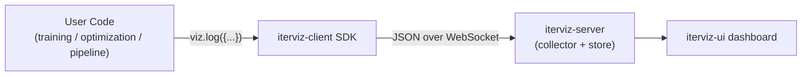
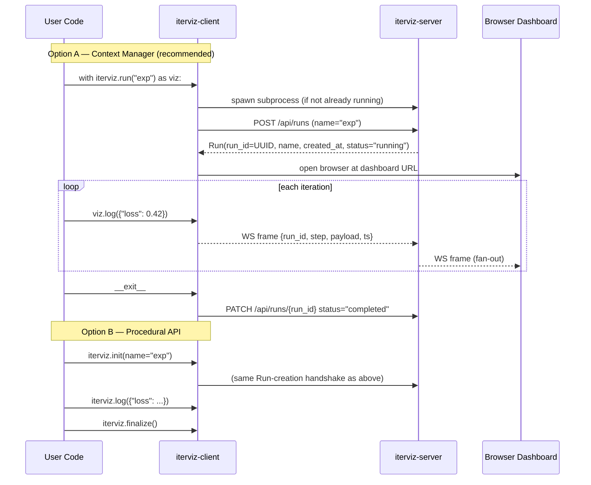

# 1.1 Project Purpose & Goals

IterViz exists to make any iterative computation observable in real time, with effectively zero friction. The same tool should serve an ML training loop, a Bayesian optimizer, a genetic algorithm, an ETL job, or a Monte-Carlo simulation.

---

## 1.1.1 Goals

1. **One-line instrumentation.** A user adds `with iterviz.run("name") as viz:` around an existing loop and gets a live dashboard.
2. **Zero configuration.** Sensible defaults for chart types, layout, refresh rate, and window size — no config file required.
3. **Domain-agnostic.** No ML-specific concepts in the core API. The SDK speaks in terms of `Run`s and arbitrary `payload` dicts.
4. **Safe by default.** Visualization failures must *never* crash the host process. Telemetry runs fire-and-forget.
5. **Local-first.** The default deployment is a subprocess on the user's own machine; no servers, accounts, or network egress required.

## 1.1.2 Non-goals (Phase 1)

* Multi-tenant hosted dashboards.
* Authentication, authorization, RBAC.
* Long-term persistence (SQLite arrives in Phase 2b).
* Distributed/cluster-aware aggregation.
* Protobuf, gRPC, or any binary wire format.
* Shared-memory transport.

---

## 1.1.3 Data Flow Concept

Every payload is JSON, every transport hop is a WebSocket. There is no other wire format and no other transport in Phase 1.

---

## 1.1.4 Integration Architecture

Both APIs produce the same on-the-wire behavior. The context manager is preferred because it guarantees `finalize` runs on exceptions.

---

## 1.1.5 System Design Philosophy

* **Fire-and-forget telemetry.** Every exception inside the SDK's transport, serialization, or collector code is caught at the boundary, logged to stderr, and swallowed. The host process must never observe an `iterviz` exception. This is non-negotiable: IterViz is observation infrastructure and observation infrastructure that crashes its host is worse than no observation at all.
* **Local-first, not cloud-first.** Auto-spawning a subprocess on the user's machine is the default; remote servers are an opt-in via `server_url`.
* **JSON-first.** Human-readable payloads are easier to debug than binary ones, and the bandwidth difference is negligible at typical iteration rates (<1 kHz). Binary formats can be added later if profiling demands it.
* **WebSocket-first.** A single transport keeps the client, server, and tests simple. File and shared-memory transports add surface area we don't need yet.
* **Domain-agnostic primitives.** `Run` and `payload` are intentionally generic. The UI builds ML-specific affordances on top, but the core never assumes ML.

---

## 1.1.6 Success criteria

A Phase 1 implementation is considered successful if a new user can:

1. `pip install iterviz`
2. Wrap an existing loop in `with iterviz.run("exp") as viz:`
3. See live charts in their browser within five seconds of starting the loop
4. Have IterViz silently no-op (and log a warning) if the dashboard is closed mid-run

…all without ever opening a config file or reading more than the README.
