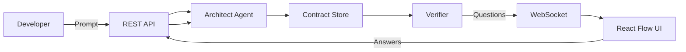
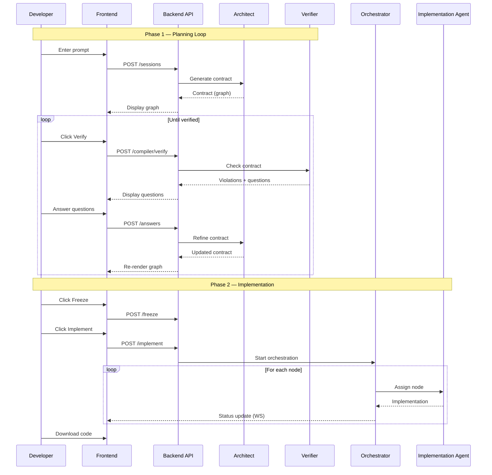

# 1.1 Project Purpose & Goals

IterViz exists to bridge the gap between high-level software ideas and working implementations. It provides a visual, interactive environment where developers can collaborate with AI agents to design, verify, and implement software systems.

---

## 1.1.1 Goals

1. **Prompt-to-architecture.** A developer enters a natural language description; an Architect agent generates a complete system graph with components, data flows, and interfaces.

2. **Developer-in-the-loop verification.** The Verifier checks for consistency, completeness, and unhandled failure scenarios. Developers answer targeted questions to resolve ambiguities before implementation begins.

3. **Visual system design.** Interactive graph visualization with React Flow lets developers see and edit the system architecture directly. Node confidence scores, status badges, and provenance indicators provide at-a-glance understanding.

4. **Multi-agent implementation.** Once the contract is verified and frozen, multiple agents implement components in parallel. The UI shows real-time progress as nodes transition through states.

5. **Implementation subgraphs.** Each high-level node can expand into a detailed subgraph showing the implementation tasks, function breakdowns, and test coverage — providing visibility into agent work.

## 1.1.2 Non-Goals

* **Fully autonomous code generation.** IterViz keeps the developer in the loop for critical decisions. The goal is augmentation, not replacement.

* **Production deployment.** Generated code is a starting point, not production-ready output. Developers should review, test, and refine.

* **Multi-tenant SaaS.** IterViz runs locally on the developer's machine. There's no authentication, user management, or hosted infrastructure.

---

## 1.1.3 Data Flow Concept

The developer interacts through the browser UI. All state is persisted in SQLite. WebSocket provides real-time updates for contract changes, verification results, and implementation progress.

---

## 1.1.4 Two-Phase Architecture

---

## 1.1.5 System Design Philosophy

* **Graph-first thinking.** Software systems are naturally graphs of components and connections. IterViz makes this explicit and visual, helping both developers and agents reason about architecture.

* **Verification before implementation.** Catching design issues early is cheaper than fixing them in code. The Verifier ensures contracts are consistent and complete before agents start implementing.

* **Provenance tracking.** Every decision in the contract is tagged with who made it (agent or user) and why. This enables the Verifier to distinguish confident agent choices from guesses that need human confirmation.

* **Real-time visibility.** WebSocket streaming ensures the UI always reflects current state. Developers see implementation progress as it happens, not after the fact.

* **Graceful degradation.** If an agent fails or gets stuck, the system continues. Developers can intervene, reassign work, or manually complete components.

---

## 1.1.6 Success Criteria

The implementation is successful when:

1. A developer can enter a prompt and see a system graph within 15 seconds
2. The Verifier catches common issues (orphaned nodes, missing payloads, unhandled failures)
3. The planning loop converges in 2-3 iterations for typical prompts
4. Multiple agents can implement nodes in parallel with visible progress
5. Generated code compiles and provides a reasonable starting point

---

## 1.1.7 Key Concepts

**Contract:** A graph-based representation of a software system containing nodes (components), edges (connections), failure scenarios, and decisions.

**Node:** A component in the system — service, store, external API, etc. Has name, description, responsibilities, confidence score, status, and provenance.

**Edge:** A connection between nodes — data flow, control flow, or dependency. Includes label, payload schema, and failure handling.

**Verification:** The Verifier runs passes to check invariants (no orphaned nodes, all edges have payloads), provenance (load-bearing decisions need confirmation), and failure scenarios (external connections need handlers).

**UVDC (User-Visible Decision Coverage):** The percentage of load-bearing decisions that have been explicitly confirmed by the user vs. assumed by the agent. Higher UVDC means more confidence in the design.

**Implementation Subgraph:** A detailed breakdown of the implementation tasks for a single node. Shows functions, tests, types, and their dependencies.
