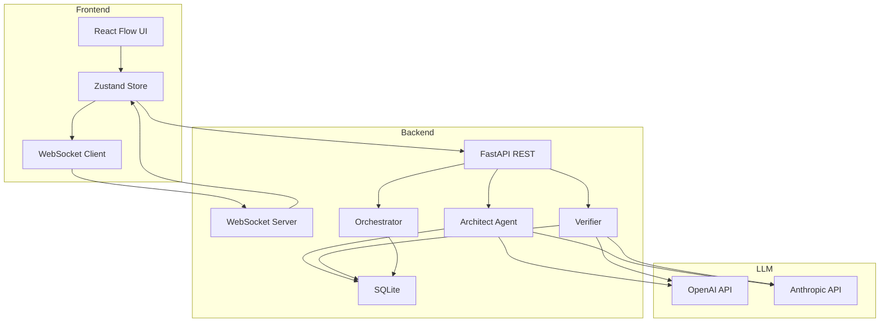
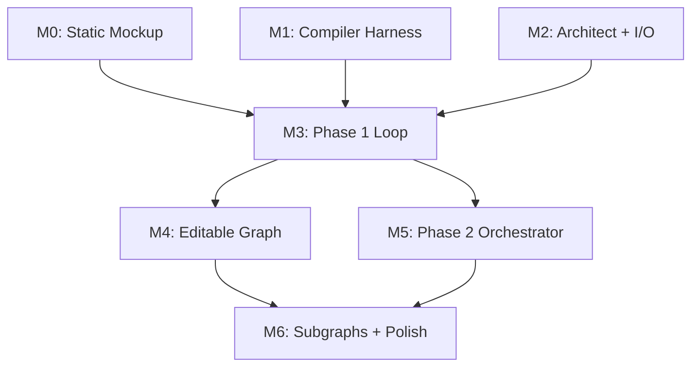

# 1.2 Repository Status & Roadmap

> **Current status:** Active development. Phase 1 (planning loop) and Phase 2 (multi-agent implementation) are complete. M6 (implementation subgraphs) is in progress.

This page describes the actual repository layout and milestone roadmap.

---

## 1.2.1 Directory Structure

```
IterViz/
├── README.md
├── TODO.md                     # Detailed milestone breakdown
├── SPEC.md                     # Product specification
├── ARCHITECTURE.md             # System architecture
├── backend/                    # FastAPI Python backend
│   ├── pyproject.toml
│   ├── requirements.txt
│   ├── app/
│   │   ├── api.py              # REST endpoints
│   │   ├── ws.py               # WebSocket for live updates
│   │   ├── architect.py        # Architect agent
│   │   ├── compiler.py         # Verifier
│   │   ├── orchestrator.py     # Phase 2 coordinator
│   │   ├── agents.py           # External agent registry
│   │   ├── assignments.py      # Node assignment tracking
│   │   ├── contract.py         # Contract persistence
│   │   ├── schemas.py          # Pydantic models
│   │   ├── llm.py              # LLM wrapper (OpenAI/Anthropic)
│   │   ├── logger.py           # Structured logging
│   │   └── prompts/            # LLM system prompts
│   ├── scripts/
│   │   ├── eval_compiler.py    # Verification harness
│   │   └── seed_contracts/     # Test fixtures
│   └── tests/                  # pytest suite
├── frontend/                   # React + Vite + TypeScript
│   ├── package.json
│   └── src/
│       ├── components/
│       │   ├── Graph.tsx       # React Flow renderer
│       │   ├── NodeCard.tsx    # Custom node component
│       │   ├── EdgeLabel.tsx   # Edge visualization
│       │   ├── QuestionPanel.tsx
│       │   ├── ControlBar.tsx
│       │   ├── PromptInput.tsx
│       │   └── AgentPanel.tsx
│       ├── state/
│       │   ├── contract.ts     # Zustand store
│       │   └── websocket.ts    # WS connection
│       ├── api/
│       │   └── client.ts       # Backend API wrapper
│       └── types/
│           └── contract.ts     # TypeScript types
├── docs/                       # Documentation
└── scripts/
    └── parallel-dev/           # Multi-agent development workflow
```

---

## 1.2.2 Component Interaction Map



---

## 1.2.3 Milestone Roadmap

The project is organized into milestones (M0-M6) that can be developed in parallel where dependencies allow:



### M0 — Static React Flow Mockup (Complete)

* React + Vite + TypeScript setup
* React Flow integration with dagre layout
* Custom `NodeCard` component with status badges
* Sample contracts for testing layout

### M1 — Compiler Tuning Harness (Complete)

* Pydantic schemas for Contract, Node, Edge, Violation
* LLM wrapper with `instructor` for structured output
* 8 seed contracts with expected violations
* Evaluation harness with recall/precision metrics
* Supports both OpenAI and Anthropic

### M2 — Architect Agent + Contract I/O (Complete)

* Architect agent generates contracts from prompts
* SQLite persistence for sessions and contracts
* FastAPI endpoints for session management
* Contract versioning and history

### M3 — Phase 1 Loop End-to-End (Complete)

* Full Architect → Verifier → Q&A → Refine loop
* Frontend wired to live backend
* Question panel with affected node highlighting
* Visual diff showing contract changes
* Loop converges in 2-3 iterations

### M4 — Editable Graph + Decision Provenance (Complete)

* Inline editing of node fields
* `decided_by: user` provenance tracking
* UVDC (User-Visible Decision Coverage) calculation
* Verifier respects user decisions

### M5 — Phase 2 Orchestrator (Complete)

* Contract freezing with hash verification
* Multi-agent implementation coordination
* Internal mode (LLM subagents) and external mode (API)
* WebSocket broadcasts for status updates
* Agent registration and assignment tracking
* Generated code download

### M6 — Implementation Subgraphs + Polish (In Progress)

* Implementation subgraph generation per node
* Subgraph visualization with React Flow
* Real-time subgraph progress updates
* Draggable detail popups
* Error handling and loading states
* Demo replay mode

---

## 1.2.4 Development Setup

See [README.md](../README.md#quick-start) for installation and running instructions.

**Prerequisites:**
- Python 3.10+
- Node.js 18+
- `ANTHROPIC_API_KEY` or `OPENAI_API_KEY`

**Backend:**
```bash
cd backend
pip install -r requirements.txt
DEBUG=1 uvicorn app.main:app --reload
```

**Frontend:**
```bash
cd frontend
npm install
npm run dev
```

**Testing:**
```bash
cd backend
pytest tests/ -v
pytest tests/ --cov=app --cov-report=term-missing
```

---

## 1.2.5 Environment Variables

| Variable | Description | Default |
|----------|-------------|---------|
| `ANTHROPIC_API_KEY` | Anthropic API key | — |
| `OPENAI_API_KEY` | OpenAI API key | — |
| `GLASSHOUSE_LLM_PROVIDER` | Force `openai` or `anthropic` | Auto-detect |
| `GLASSHOUSE_COMPILER_MODEL` | Override model | `claude-opus-4-5` |
| `DEBUG` | Enable verbose logging | `0` |
