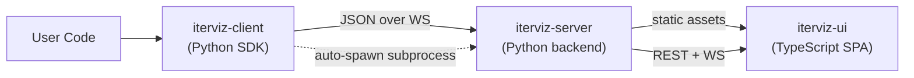

# 1.2 Repository Status & Roadmap

> **Current status:** Planning / bootstrapping. The repository contains a `README.md` and this design-doc set under `docs/`. No source code has been committed yet.

This page describes the target monorepo layout and the six-phase roadmap.

---

## 1.2.1 Target directory structure

```
IterViz/
├── README.md
├── Makefile                    # or justfile — coordinates cross-package builds
├── packages/
│   ├── iterviz-client/
│   │   ├── pyproject.toml
│   │   ├── iterviz_client/
│   │   └── tests/
│   ├── iterviz-server/
│   │   ├── pyproject.toml
│   │   ├── iterviz_server/
│   │   └── tests/
│   └── iterviz-ui/
│       ├── package.json
│       ├── src/
│       └── tests/
└── tests/
    └── integration/            # cross-package end-to-end tests
```

* Three independently-versioned packages live under `packages/`. There is **no** single top-level Python package and **no** `setup.py`; each Python package owns its own `pyproject.toml`.
* `iterviz-client` (the SDK) optionally depends on `iterviz-server` so that `iterviz.init()` can auto-spawn a local server subprocess. If the server package isn't installed, the client falls back to remote-only mode (the user must pass `server_url`).
* `iterviz-server` bundles the built `iterviz-ui` static assets so the user only ever installs Python packages.
* Cross-package end-to-end tests live in the top-level `tests/integration/` directory.

The legacy `src/iterviz_collector/` and `src/iterviz_frontend/` layout from earlier drafts has been **removed** in favor of this monorepo structure.

---

## 1.2.2 Component Interaction Map



Notes:

* The wire format is JSON only. Protobuf has been removed from the Phase 1 plan.
* The client→server hop is always a WebSocket in Phase 1.
* Client→server auto-spawn is only available when both packages are installed in the same environment.

---

## 1.2.3 Six-phase roadmap

The original three-phase plan has been replaced with a more granular six-phase roadmap:

### Phase 0 — Scaffolding

* Monorepo layout under `packages/`.
* CI via GitHub Actions: lint, type-check, test on every PR.
* Static analysis baseline: `ruff` (linting), `mypy` (type checking).
* Framework selection from the recommendation tables in [2.3](02-3-rendering-engine-and-frontend-ui.md). No code yet — just decisions and skeleton `pyproject.toml` / `package.json` files.

### Phase 1a — Client + Server MVP

* `iterviz.init()` / `viz.log()` / `viz.finalize()` procedural API.
* `with iterviz.run("name") as viz:` context manager.
* WebSocket JSON transport.
* In-memory ring buffer keyed by `run_id`.
* `Run` dataclass (`run_id`, `name`, `created_at`, `status`, `metadata`).
* REST endpoints `/api/runs` and `/api/metrics`.
* Marker logging (5 lines per session).
* Fire-and-forget exception handling at every transport boundary.

### Phase 1b — Minimal Frontend

* `iterviz-ui` SPA, built and served by `iterviz-server`.
* Auto-detected line charts from scalar payloads.
* Live updates via WebSocket subscription.
* Run name displayed in the dashboard header.
* Responsive auto-grid layout.

### Phase 2a — Configuration & Transforms

* YAML / dict opt-in configuration.
* Moving averages, LTTB downsampling, normalization transforms.
* Multi-metric dashboards, explicit grid layout config.

### Phase 2b — Persistence & Runs

* SQLite storage backend (replacing or supplementing the in-memory ring buffer).
* Run listing, comparison, and overlay in the UI.
* JSONL file transport for offline / batch ingestion.

### Phase 3 — Polish & Publish

* Histogram and scatter chart types.
* PyPI publication for `iterviz-client` and `iterviz-server`.
* Hosted documentation site.
* Visual regression test suite for the frontend.

---

## 1.2.4 Guidance for Contributors

* The repo uses **per-package `pyproject.toml` files**, not a top-level `setup.py`. Don't create a `setup.py` — it will be rejected at review.
* Run code lives in `packages/<pkg>/<pkg_module>/`; tests live next to it in `packages/<pkg>/tests/`. Cross-package integration tests go in the top-level `tests/integration/`.
* Lint with `ruff` and type-check with `mypy` before pushing. Both are wired into CI; failing either will block the PR.
* When adding a new metric type or chart, do so in the appropriate package — collectors and stores in `iterviz-server`, chart components in `iterviz-ui`. Never bypass the layered structure by, e.g., putting rendering logic in the SDK.
* See [4.1 Development Environment Setup](04-1-development-environment-setup.md) for `Makefile` targets (`make build-ui`, `make dev-server`, `make test-all`, `make lint`, `make typecheck`).
