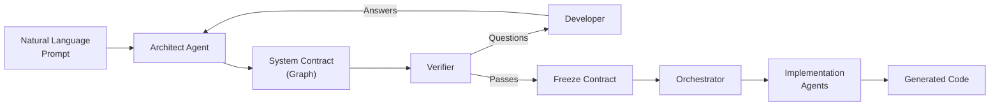
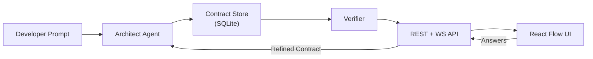
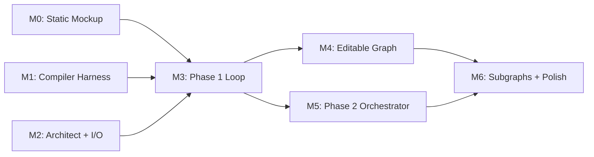

# 1. Overview

IterViz is a visual AI agent orchestrator for software architecture planning. It transforms natural language prompts into verified system designs represented as interactive graphs, then coordinates multiple agents to implement each component while providing real-time progress visualization.

This page summarizes the system at a glance. Each subsystem is described in more detail in pages 2.x; the implementation roadmap is in [1.2](01-2-repository-status-and-roadmap.md).

---

## 1.1 What IterViz Is

* A **Python backend** (`backend/`) that hosts the Architect agent, Verifier, and multi-agent Orchestrator.
* A **TypeScript frontend** (`frontend/`) that renders interactive system graphs with React Flow and provides real-time progress updates.
* A **developer-in-the-loop verification** system that ensures AI-generated architectures meet consistency and completeness requirements before implementation begins.

A typical workflow: enter a prompt like *"Build a Slack bot that summarizes unread DMs daily"*, watch the Architect generate a system graph, answer clarifying questions from the Verifier, then watch multiple agents implement each node in parallel.

---

## 1.2 Conceptual Workflow

The system operates in two phases:

**Phase 1 — Planning Loop:** The Architect generates a contract (graph), the Verifier checks it for issues, the developer answers questions, and the cycle repeats until the contract passes verification.

**Phase 2 — Implementation:** The verified contract is frozen, the Orchestrator assigns nodes to agents, and agents implement components in parallel while the UI shows real-time progress.

---

## 1.3 System Data Flow

All communication uses **JSON over REST and WebSocket**. The frontend connects via WebSocket to receive real-time updates as nodes transition through implementation states.

---

## 1.4 Component Status

| Component | Language | Status | Description |
|-----------|----------|--------|-------------|
| `backend/app/architect.py` | Python | Implemented | Generates contracts from prompts |
| `backend/app/compiler.py` | Python | Implemented | Verifies contracts, emits violations |
| `backend/app/orchestrator.py` | Python | Implemented | Coordinates multi-agent implementation |
| `backend/app/ws.py` | Python | Implemented | WebSocket for live updates |
| `frontend/src/components/Graph.tsx` | TypeScript | Implemented | React Flow graph renderer |
| `frontend/src/components/NodeCard.tsx` | TypeScript | Implemented | Custom node visualization |
| Implementation Subgraphs | Both | In Progress | Detailed task breakdown per node |

---

## 1.5 Roadmap at a Glance

| Milestone | Status |
|-----------|--------|
| M0-M5 | Complete |
| M6 (Implementation Subgraphs) | In Progress |

Full details in [1.2](01-2-repository-status-and-roadmap.md) and [TODO.md](../TODO.md).

---

## 1.6 Where to Go Next

* If you want to **use** IterViz: see the [Quick Start](../README.md#quick-start) in the README.
* If you want to **understand** the architecture: see [2 Architecture](02-architecture.md).
* If you want to **configure** the system: see [3 Configuration](03-configuration.md).
