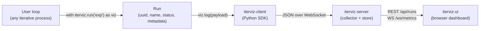
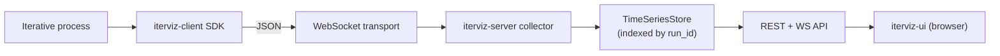
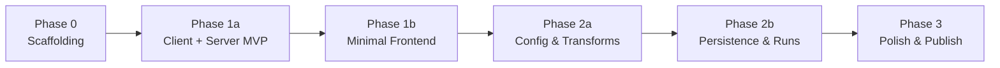

# 1. Overview

IterViz is a real-time visualization layer for *iterative processes* — any program that produces a stream of metrics one step at a time. Common examples include machine-learning training loops, numerical optimization solvers, simulations, and data pipelines, but IterViz makes no domain-specific assumptions: the unit of observation is a generic **Run**.

This page summarizes the system at a glance. Each subsystem is described in more detail in pages 2.x; the implementation roadmap is in [1.2](01-2-repository-status-and-roadmap.md).

---

## 1.1 What IterViz is

* A **Python SDK** (`iterviz-client`) that user code imports to log per-iteration metrics.
* A **Python backend** (`iterviz-server`) that collects metrics, stores them in memory, and serves a dashboard.
* A **TypeScript frontend** (`iterviz-ui`) served by the backend, that renders charts live as data arrives.

A typical user adds three lines to an existing loop and gets a live dashboard at `http://localhost:8765` for free, with no configuration.

---

## 1.2 Conceptual workflow

Every observed program is wrapped (explicitly via context manager / decorator, or implicitly via `init()`/`finalize()`) into a single **Run**. Runs are independent units that the UI can list, overlay, and compare.

---

## 1.3 System data flow

Phase 1 uses **JSON exclusively** as the wire format; Protobuf is explicitly out of scope. Transport is **WebSocket only** in Phase 1; JSONL file transport is planned for Phase 2b.

---

## 1.4 Component status

| Package | Language | Status | Phase introduced |
|---|---|---|---|
| `iterviz-client` | Python | Planned | Phase 1a |
| `iterviz-server` | Python | Planned | Phase 1a |
| `iterviz-ui` | TypeScript | Planned | Phase 1b |
| `iterviz-config` (YAML/dict layer) | Python | Planned | Phase 2a |
| `iterviz-store-sqlite` | Python | Planned | Phase 2b |

All components live in a single monorepo under `packages/`. See [1.2](01-2-repository-status-and-roadmap.md) for the directory layout.

---

## 1.5 Roadmap at a glance

Six phases replace the original three-phase plan. Full details in [1.2](01-2-repository-status-and-roadmap.md).

---

## 1.6 Where to go next

* If you want to **use** IterViz: see [3.2 Usage Examples & Integration Guide](03-2-usage-examples-and-integration-guide.md).
* If you want to **understand** IterViz: see [2 Architecture](02-architecture.md).
* If you want to **contribute** to IterViz: see [4 Contributing](04-contributing.md) and [4.1 Development Environment Setup](04-1-development-environment-setup.md).
