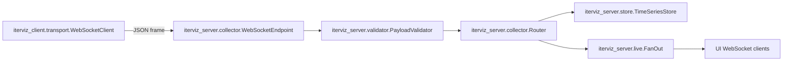

# 2.1 Data Ingestion & Telemetry Collection

This page describes how metrics travel from the user's iterative loop into IterViz's storage layer.

---

## 2.1.1 Supported Transport Mechanisms

**Phase 1 supports WebSocket transport only.**

| Transport | Phase | Notes |
|---|---|---|
| WebSocket | Phase 1a | Sole transport in Phase 1. JSON frames, bidirectional, reconnect-with-backoff. |
| JSONL file | Phase 2b | Append-only file the SDK writes to and the server tails. Useful for offline / batch ingestion. |
| Shared memory | Removed | Cut from the plan; not in any phase. |

The decision to constrain Phase 1 to WebSocket simplifies the client/server contract, the test matrix, and the failure model. Additional transports can be added once the WebSocket path is solid.

---

## 2.1.2 Payload Structure

Every frame on the wire is a single JSON object:

```json
{
  "run_id": "0f6c2d4e-1c2a-4b8a-9c1f-3a5b8e7c0d12",
  "step": 42,
  "ts": 1731436800.123,
  "payload": {
    "loss": 0.4231,
    "accuracy": 0.875,
    "weights_histogram": [0.01, 0.03, 0.07, 0.12, 0.21, 0.27, 0.18, 0.07, 0.03, 0.01]
  }
}
```

| Field | Type | Required | Description |
|---|---|---|---|
| `run_id` | UUID string | yes | Identifies which Run this frame belongs to. Set by the server at run-creation time and stamped onto every subsequent frame by the SDK. |
| `step` | integer | yes | Monotonically increasing iteration counter within the Run. |
| `ts` | float (epoch seconds) | yes | Client-side wall-clock timestamp. Used for x-axis when `step` is not preferred. |
| `payload` | object | yes | The user's metric dict. Keys are metric names; values are scalars or arrays. |

Scalar values render as line charts; array values render as histograms. See [3.1 Configuration Schema Reference](03-1-configuration-schema-reference.md) for auto-detection rules.

---

## 2.1.3 Telemetry Collector Subsystem



* `iterviz_server.collector.WebSocketEndpoint` accepts incoming connections, parses frames, and hands them to the validator.
* `iterviz_server.validator.PayloadValidator` enforces the schema in 2.1.2 and rejects malformed frames.
* `iterviz_server.collector.Router` dispatches accepted frames to the store and the live fan-out simultaneously.
* `iterviz_server.store.TimeSeriesStore` (described in [2.2](02-2-data-transformation-and-storage.md)) appends to the appropriate ring buffer.

---

## 2.1.4 Implementation Mapping

| Concern | Code entity |
|---|---|
| User-facing log call | `iterviz_client.log_iteration` |
| Context manager | `iterviz_client.run` |
| Decorator | `iterviz_client.track` |
| Transport client | `iterviz_client.transport.WebSocketClient` |
| Transport server | `iterviz_server.collector.TelemetryServer` |
| Frame validator | `iterviz_server.validator.PayloadValidator` |
| Run lifecycle | `iterviz_server.runs.RunRegistry` |
| Time-series storage | `iterviz_server.store.TimeSeriesStore` |
| Live fan-out | `iterviz_server.live.FanOut` |

All paths reflect the new monorepo / per-package structure. The legacy `iterviz.server.collector.*` and `iterviz.common.schema.*` paths from earlier drafts have been replaced with the package-prefixed names above.

---

## 2.1.5 Error Handling & Fault Tolerance

IterViz operates in **fire-and-forget** mode by default. The contract is:

* Any exception raised inside the SDK's `log`, `init`, or `finalize` paths — including transport errors, serialization errors, and remote server errors — is caught at the SDK boundary, logged to stderr (or to `~/.iterviz/logs/` for debug-level), and **never propagated to the host process**.
* If the WebSocket connection drops mid-Run, the client transitions to `RECONNECTING`, queues outgoing frames in a small bounded ring buffer, and reconnects with exponential backoff (capped at ~30s). Once reconnected, queued frames are flushed in order. If the buffer overflows, the oldest frames are dropped and a single warning is logged.
* If the client cannot reach a server at all (auto-spawn failed, no `server_url` works), the SDK degrades to a no-op and emits a one-time warning.

This guarantees that adding IterViz to a long-running training job can never cause that job to fail.

---

## 2.1.6 Logging Strategy

IterViz uses Python's standard `logging` module via a custom `IterVizHandler`. There are three log surfaces:

* **stdout — marker logs.** Five concise lines per session, designed to confirm operation without cluttering the terminal:
  1. `iterviz: server started on http://localhost:8765`
  2. `iterviz: dashboard at http://localhost:8765`
  3. `iterviz: run created (run_id=…, name="exp")`
  4. `iterviz: receiving metrics`
  5. `iterviz: run completed (run_id=…)`
* **stderr — warnings and errors.** Reconnect attempts, dropped frames, validation failures, telemetry exceptions caught by the fire-and-forget boundary.
* **`~/.iterviz/logs/` — debug.** Verbose per-frame logs and stack traces from caught exceptions. Promoted to stderr when `verbose=True` is passed to `init` / `run` / `track`.
