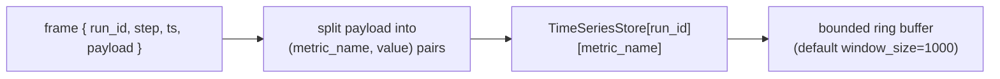
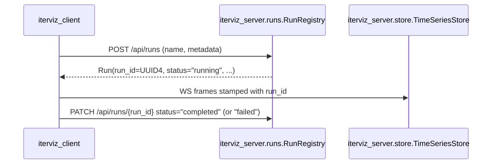

# 2.2 Data Transformation & Storage

This page describes how IterViz stores accepted telemetry frames and what transformations it applies to them on the way to the UI.

---

## 2.2.1 The `Run` dataclass

```python
from dataclasses import dataclass, field
from datetime import datetime
from typing import Any, Literal
from uuid import UUID

@dataclass
class Run:
    run_id: UUID                         # generated server-side at creation time
    name: str                            # user-provided, may be non-unique
    created_at: datetime                 # UTC, set on creation
    status: Literal["running", "completed", "failed"] = "running"
    metadata: dict[str, Any] = field(default_factory=dict)
```

* `run_id` is the canonical identifier. It is generated server-side as a UUID4 the moment a Run is created. Every subsequent frame, REST call, and WS subscription references the run by `run_id`.
* `name` is informational; multiple Runs may share the same name.
* `status` transitions are `running → completed` (normal exit) or `running → failed` (exception in user code, propagated by the context manager / decorator on its way out).
* `metadata` is a free-form dict the user can populate via `iterviz.run("name", metadata={...})`.

---

## 2.2.2 TimeSeriesStore

The store is keyed by `(run_id, metric_name)`:



* The store keeps an independent bounded ring buffer per `(run_id, metric_name)` pair.
* Default `window_size` is 1000 points; configurable in Phase 2a.
* In Phase 1 the store is purely in-memory. In Phase 2b a SQLite backend is introduced for persistence and historical Run browsing.
* Code entity: `iterviz_server.store.TimeSeriesStore`.

---

## 2.2.3 Run lifecycle



Each call to `iterviz.init()` / `iterviz.run()` / `@iterviz.track` creates a **fresh** Run with a new UUID. There is no implicit reuse of a previous Run, which removes any "stale data" ambiguity: a re-run never overwrites a previous Run's data, it simply gets its own `run_id` keyspace in the store.

---

## 2.2.4 REST surface

| Method + path | Purpose |
|---|---|
| `POST /api/runs` | Create a Run; returns the new `Run` JSON. |
| `GET /api/runs` | List Runs (with optional filters by status, name, time range). |
| `GET /api/runs/{run_id}` | Fetch a single Run. |
| `PATCH /api/runs/{run_id}` | Update status / metadata (used by the SDK to mark completion). |
| `GET /api/metrics?run_id=…` | Dump the current store contents for a Run. |

The live WebSocket endpoint (`/ws/metrics`) streams new frames as they arrive; the REST endpoints provide point-in-time snapshots and historical Run browsing.

---

## 2.2.5 Time-Series Considerations

* **Stale data is not a concern.** Because every `init()` creates a new Run with a unique `run_id`, there is no overwrite path between Runs. Two simultaneous Runs of the same `name` simply produce two distinct keyspaces in the store; the UI shows both in the Run list.
* **Bounded memory.** Each ring buffer is bounded by `window_size`. A long-running optimization that emits one frame per millisecond will not cause unbounded memory growth — the oldest points are evicted past the window. (Phase 2a transforms like LTTB downsampling extend the effective window without raising memory.)
* **Consistency.** The store is single-writer (the collector). Readers (REST + WS fan-out) see a consistent view because writes happen in a single asyncio task per Run.

---

## 2.2.6 Implementation entities

| Concern | Code entity |
|---|---|
| Run dataclass | `iterviz_server.runs.Run` |
| Run registry | `iterviz_server.runs.RunRegistry` |
| Time-series store | `iterviz_server.store.TimeSeriesStore` |
| In-memory ring buffer | `iterviz_server.store.RingBuffer` |
| SQLite backend (Phase 2b) | `iterviz_server.store.SqliteStore` |
| Transforms (Phase 2a) | `iterviz_server.transforms.{moving_average, lttb, normalize}` |
