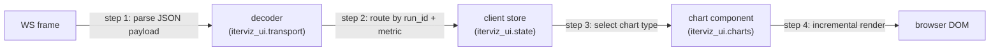

# 2.3 Rendering Engine & Frontend UI

`iterviz-ui` is the TypeScript SPA that renders the dashboard. It is built once and served as static assets by `iterviz-server` so the user only ever installs Python packages.

---

## 2.3.1 Rendering Pipeline

1. **Parse JSON payload.** The frontend speaks JSON only — there is no Protobuf decoder. Frames arrive over the `/ws/metrics` WebSocket.
2. **Route by run_id + metric_name.** Each frame is split into `(run_id, metric_name, step, value)` tuples and appended to the relevant client-side time series.
3. **Select chart type.** On a metric's first value, IterViz auto-detects: scalars become line charts; arrays become histograms.
4. **Incremental render.** Charts are updated in place at the configured `refresh_interval_ms` (default 200 ms) rather than being torn down each frame.

---

## 2.3.2 Layout

* The default layout is an **auto-grid**: charts wrap into a responsive grid sized to the viewport, with each Run's currently-active metrics occupying one tile each.
* The dashboard header shows the Run's `name` and a short `run_id` prefix.
* In Phase 2a, users can override the layout via YAML config; in Phase 2b, the Run list view supports overlay (compare metric X across multiple Runs in a single chart).

---

## 2.3.3 Framework Recommendations

These are **recommendations, not locks**. The Phase 0 implementation session picks one option per layer and records the choice in the relevant package's README.

### Backend HTTP/WS framework

| Option | Pros | Cons |
|---|---|---|
| **FastAPI + uvicorn** | Modern async, automatic OpenAPI, large ecosystem, built-in WebSocket support. | Heavier dependency than aiohttp; opinionated. |
| **aiohttp** | Mature async, lean, good WebSocket primitives. | Less Pydantic/typing integration than FastAPI. |
| **Tornado** | Long-standing, battle-tested. | Older API style; smaller community now. |

### Frontend framework

| Option | Pros | Cons |
|---|---|---|
| **React** | Largest ecosystem, deep talent pool, great chart libs. | Bundle size larger than Preact / Svelte. |
| **Preact** | Tiny (~3 kB), React-compatible. | Slightly smaller ecosystem; some libs require shims. |
| **Svelte** | Compile-time, very small runtime, ergonomic. | Different mental model from React. |
| **Vanilla TS** | Smallest possible bundle, no framework lock-in. | Manual state plumbing; slower to iterate. |

### Charting library

| Option | Pros | Cons |
|---|---|---|
| **uPlot** | Extremely fast, designed for time series. | Imperative API; less flexible for non-line charts. |
| **Chart.js** | Easy, good defaults, broad chart types. | Slower for tens of thousands of points. |
| **D3** | Maximum flexibility. | High effort per chart. |
| **Recharts** | React-native, pleasant API. | Slower for very high-frequency updates. |

### Build / bundler

| Option | Pros | Cons |
|---|---|---|
| **Vite** | Excellent DX, fast HMR, sane defaults. | Heavier than esbuild for tiny libs. |
| **esbuild** | Very fast, minimal config. | Less plugin ecosystem than Vite. |

---

## 2.3.4 Implementation Mapping

| Concern | Code entity |
|---|---|
| WebSocket transport client | `iterviz_ui.transport.WebSocketClient` |
| Client-side time-series store | `iterviz_ui.state.RunStore` |
| Chart-type auto-detection | `iterviz_ui.charts.detect` |
| Line chart component | `iterviz_ui.charts.LineChart` |
| Histogram component | `iterviz_ui.charts.Histogram` |
| Auto-grid layout | `iterviz_ui.layout.AutoGrid` |
| Run list / overlay (Phase 2b) | `iterviz_ui.runs.RunList` |

---

## 2.3.5 Performance budget

* Each frame carries one or a handful of `(metric_name, value)` pairs.
* The default `refresh_interval_ms` of 200 ms gives a 5 Hz update cadence regardless of incoming frame rate, so even a 1 kHz logging loop only triggers 5 paints/sec.
* Targeting 50 simultaneous metrics × 1 000 points each at 5 Hz repaint is comfortably within the budget of any of the recommended chart libraries.
