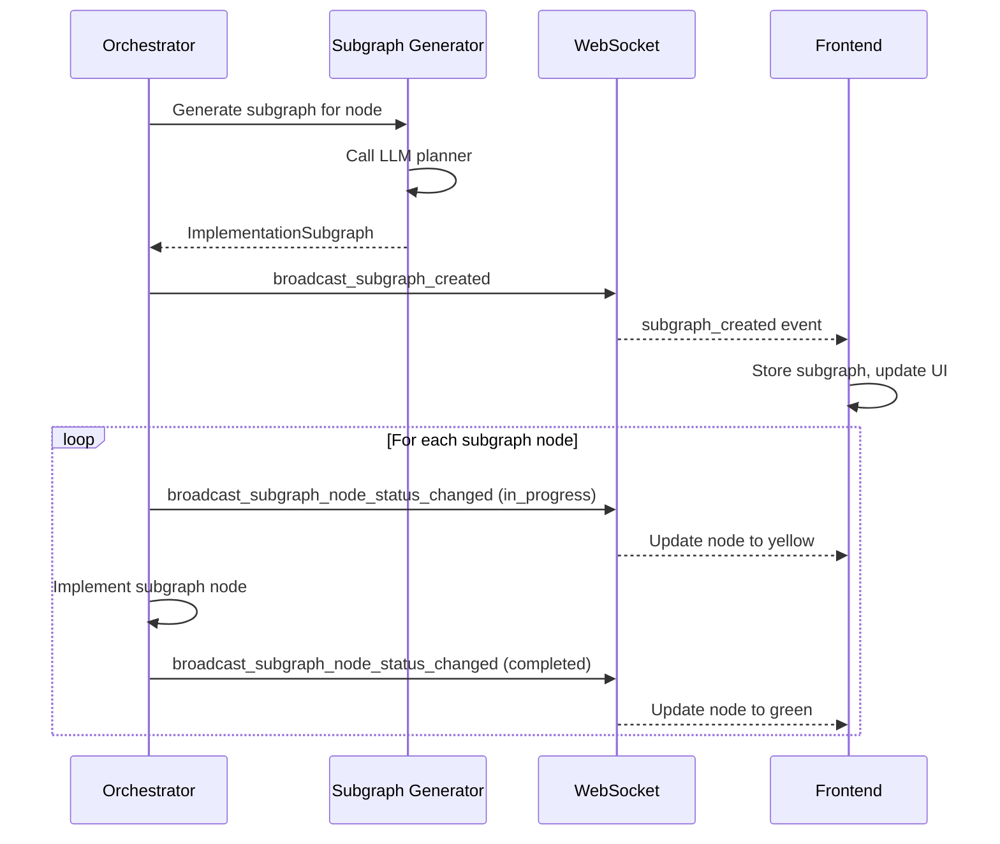

# 2.4 Implementation Subgraphs

When parallel agents are implementing nodes from the verified "big picture" graph, the system generates **implementation subgraphs** for each node. These subgraphs act as live implementation planners, showing progress as agents work through node implementation.

---

## 2.4.1 Overview

An implementation subgraph breaks down a big-picture architecture node into concrete implementation tasks:

```
Big Picture Node: "Slack OAuth Handler"
    │
    └─► Implementation Subgraph:
        ├─ [OAuth Types]           (type_def)
        ├─ [validate_token()]      (function)  ──► [Token Refresh Logic] (function)
        ├─ [check_scope()]         (function)
        ├─ [Error Handler]         (error_handler)
        ├─ [Unit Tests]            (test_unit)
        └─ [Integration Tests]     (test_integration)
```

Each subgraph node represents a specific implementation task:
- **Functions/modules** to implement
- **Tests** (unit, integration, eval)
- **Type definitions** and interfaces
- **Error handling** logic
- **Configuration** setup

---

## 2.4.2 Why No Verification Loop?

Unlike the big picture graph, subgraphs do **not** go through the Architect → Compiler → Q&A verification loop because:

1. **Parent node is verified**: The big-picture node has already achieved UVDC = 1.0 (100% User-Visible Decision Coverage)
2. **Sufficient specification**: The parent node's `responsibilities`, `assumptions`, and `payload_schema` provide all necessary context
3. **Implementation focus**: Subgraphs are about *how* to build, not *what* to build — the architecture is settled

The subgraph is generated once when implementation starts and updated as work progresses.

---

## 2.4.3 Subgraph Node Types

| Kind | Description | Example |
|------|-------------|---------|
| `function` | A function/method to implement | `def validate_token(token: str) -> OAuthToken` |
| `module` | A file/module to create | `auth_handler.py` |
| `test_unit` | Unit test for specific functions | `test_validate_token()` |
| `test_integration` | Integration test for the node | `test_oauth_flow_e2e()` |
| `test_eval` | Acceptance/evaluation test | `test_meets_latency_requirements()` |
| `type_def` | Type definitions, interfaces | `class OAuthToken(BaseModel)` |
| `config` | Configuration setup | `OAuth config loader` |
| `error_handler` | Error handling logic | `handle_token_expired()` |
| `util` | Utility/helper code | `token_validator.py` |

---

## 2.4.4 Live Progress Visualization

As the implementing agent works, subgraph nodes transition through visual states:

| Status | Visual Appearance | Description |
|--------|-------------------|-------------|
| `pending` | Gray fill, dashed border | Not yet started |
| `in_progress` | Yellow fill, solid border, pulse animation | Currently being worked on |
| `completed` | Green fill, solid border | Successfully implemented |
| `failed` | Red fill, solid border | Implementation failed |

Progress is broadcast via WebSocket, so the UI updates in real-time.

---

## 2.4.5 Navigation and Interaction

### Entering a Subgraph

- **Left-click** on a big-picture node (during implementation) to enter its subgraph view
- The subgraph is displayed with the same dagre layout algorithm as the big picture graph

### Viewing Node Details

Two types of detail popups are available:

1. **Big Picture Node Info** (top-right button on node card):
   - Shows node description, kind, and responsibilities
   - **Does NOT show assumptions** — those were for architectural verification, not implementation

2. **Subgraph Node Details** (click on subgraph node):
   - Shows function signature, description, dependencies
   - Shows implementation status
   - **No assumptions** — subgraph nodes are concrete tasks

### Popup Behavior

- Multiple popups can be open simultaneously (one from big picture, one from subgraph)
- **Same-graph constraint**: Two nodes from the *same* graph cannot have popups open simultaneously — the newer one closes the older
- All popups are **draggable/movable** via their title bar

### Returning to Big Picture

- Click the **back arrow** (top-left of subgraph view) to return to the big picture graph
- Subgraph state is preserved; you can return to see updated progress

---

## 2.4.6 Data Flow



---

## 2.4.7 API Endpoints

| Method | Path | Description |
|--------|------|-------------|
| `POST` | `/sessions/{id}/nodes/{node_id}/subgraph` | Generate subgraph for a node |
| `GET` | `/sessions/{id}/nodes/{node_id}/subgraph` | Get existing subgraph |
| `GET` | `/sessions/{id}/subgraphs` | Get all subgraphs for session |
| `PATCH` | `/sessions/{id}/nodes/{node_id}/subgraph/nodes/{sg_id}` | Update subgraph node status |

---

## 2.4.8 WebSocket Events

| Event | Payload | Description |
|-------|---------|-------------|
| `subgraph_created` | `{ parent_node_id, subgraph }` | New subgraph generated |
| `subgraph_node_status_changed` | `{ parent_node_id, subgraph_node_id, status, progress }` | Subgraph node status update |

---

## 2.4.9 Layout and Spacing

Subgraphs use the same dagre layout configuration as the big picture graph:

```javascript
dagreGraph.setGraph({
  rankdir: 'TB',      // Top to bottom
  nodesep: 60,        // Horizontal spacing between nodes
  ranksep: 80,        // Vertical spacing between ranks
});
```

This ensures visual consistency between the big picture and subgraph views.
