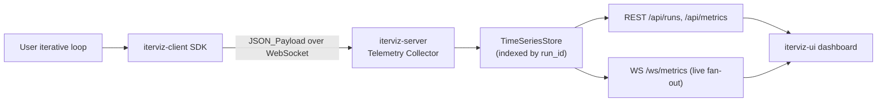
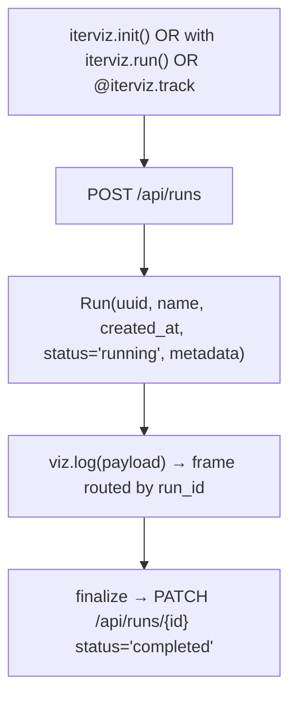

# 2. Architecture

IterViz is decomposed into three packages — `iterviz-client`, `iterviz-server`, and `iterviz-ui` — connected by JSON-over-WebSocket transport. This page gives a high-level view; subsections drill into ingestion (2.1), storage (2.2), and rendering (2.3).

---

## 2.1 System Data Flow Diagram

Every payload that crosses the client→server boundary is a JSON object. Each payload carries a `run_id` so the server can route and store it correctly even when multiple Runs are active simultaneously.

---

## 2.2 Transport

* **Phase 1: WebSocket only.** A single bidirectional WebSocket per `Run` between client and server, carrying JSON frames.
* JSONL file transport is **deferred to Phase 2b**.
* Shared-memory transport has been **removed** from the plan entirely; it added complexity without solving a real Phase-1 bottleneck.

The WebSocket is wrapped in a reconnect-with-exponential-backoff layer on the client side. Reconnects are silent from the user's perspective — the SDK queues outgoing frames in a small bounded ring buffer and replays them once the socket is back.

---

## 2.3 The Run abstraction

A **Run** is the unit of observation. Every payload belongs to exactly one Run. The server's storage layer is keyed by `run_id`, and the UI exposes Run-level operations (list, overlay, compare).

See [2.2 Data Transformation & Storage](02-2-data-transformation-and-storage.md) for the full `Run` dataclass.

---

## 2.4 Components

| Component | Package | Responsibility |
|---|---|---|
| SDK | `iterviz-client` | Public API (`init`, `log`, `finalize`, `run`, `track`); auto-spawn; transport client; fire-and-forget error boundary. |
| Telemetry Collector | `iterviz-server` | WebSocket endpoint; payload validation; routing into the store. |
| TimeSeriesStore | `iterviz-server` | In-memory ring buffer per (run_id, metric_name). SQLite backend in Phase 2b. |
| REST API | `iterviz-server` | `/api/runs`, `/api/metrics`. |
| Live API | `iterviz-server` | `/ws/metrics` fan-out. |
| Static asset server | `iterviz-server` | Serves built `iterviz-ui` bundle. |
| Dashboard | `iterviz-ui` | Auto-detected charts, run list, run overlay. |

---

## 2.5 Boundaries and invariants

* The SDK never persists data itself. Persistence is the server's responsibility.
* The server never reaches into user code. Communication is one-way: SDK → server (logging) and UI ← server (rendering).
* Run identifiers are UUIDs generated server-side at run-creation time. Clients receive the `run_id` in the response and stamp every subsequent payload with it.
* JSON is the only on-the-wire format. There is no Protobuf path, even as a hidden optimization.
