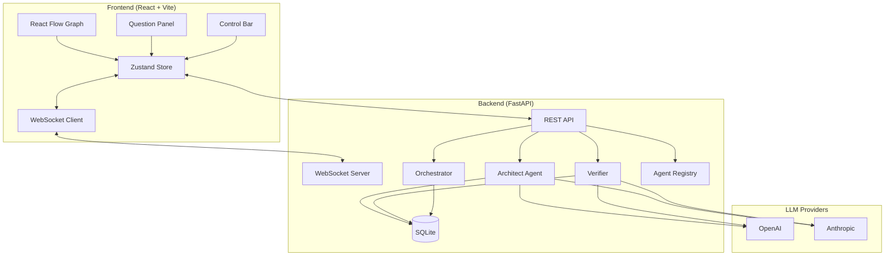
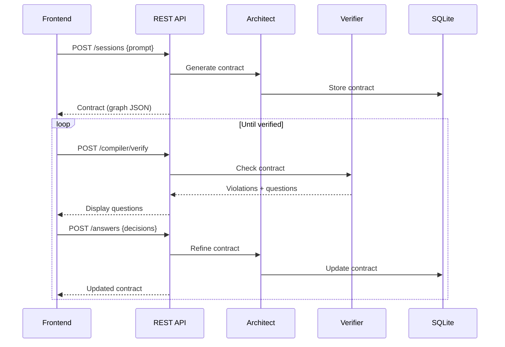
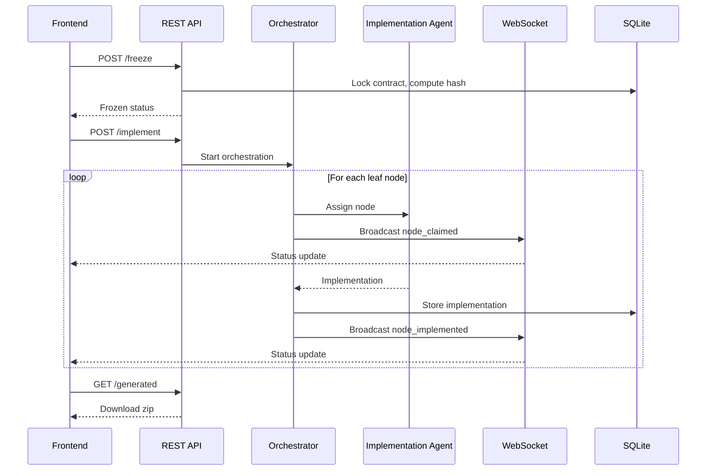
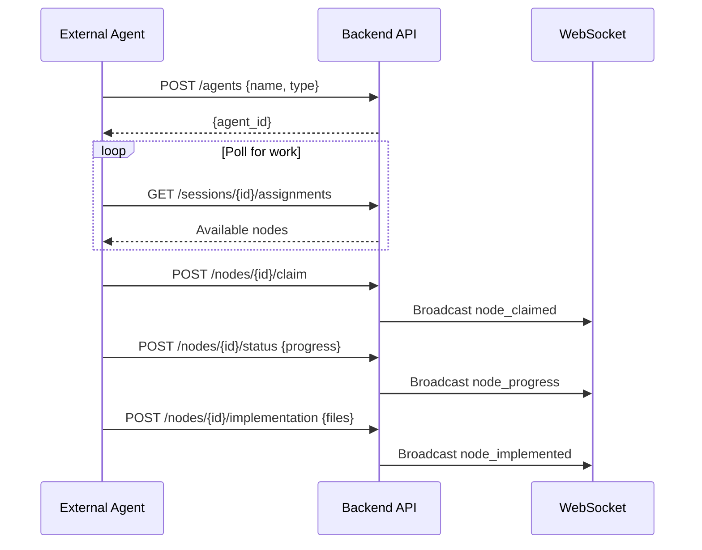

# 2. Architecture

IterViz consists of a Python backend (`backend/`) and a TypeScript frontend (`frontend/`) connected by REST API and WebSocket. This page gives a high-level view; subsections drill into specific components.

---

## 2.1 System Data Flow Diagram



All API communication uses JSON. The frontend connects via WebSocket for real-time updates (contract changes, node status transitions, agent activity).

---

## 2.2 Two-Phase Architecture

### Phase 1: Planning Loop



### Phase 2: Implementation



---

## 2.3 Backend Components

| Component | File | Responsibility |
|-----------|------|----------------|
| **REST API** | `app/api.py` | Session CRUD, verify, answers, freeze, implement endpoints |
| **WebSocket** | `app/ws.py` | Real-time broadcasts for status changes |
| **Architect** | `app/architect.py` | Generates contracts from prompts using LLM |
| **Verifier** | `app/compiler.py` | Checks invariants, provenance, failure scenarios |
| **Orchestrator** | `app/orchestrator.py` | Coordinates multi-agent implementation |
| **Agent Registry** | `app/agents.py` | External agent registration and tracking |
| **Assignments** | `app/assignments.py` | Node assignment to agents |
| **Contract Store** | `app/contract.py` | SQLite persistence for sessions/contracts |
| **Schemas** | `app/schemas.py` | Pydantic models (Contract, Node, Edge, Violation) |
| **LLM Wrapper** | `app/llm.py` | Unified interface for OpenAI/Anthropic |
| **Prompts** | `app/prompts/` | System prompts for Architect, Verifier, etc. |

### Key API Endpoints

| Method | Endpoint | Description |
|--------|----------|-------------|
| POST | `/api/v1/sessions` | Create session, generate initial contract |
| GET | `/api/v1/sessions/{id}` | Get current contract |
| POST | `/api/v1/sessions/{id}/compiler/verify` | Run verifier, get violations |
| POST | `/api/v1/sessions/{id}/answers` | Submit answers to questions |
| POST | `/api/v1/sessions/{id}/architect/refine` | Refine contract with answers |
| PATCH | `/api/v1/sessions/{id}/nodes/{node_id}` | Edit node (user provenance) |
| POST | `/api/v1/sessions/{id}/freeze` | Lock contract for implementation |
| POST | `/api/v1/sessions/{id}/implement` | Start multi-agent implementation |
| GET | `/api/v1/sessions/{id}/generated` | Download generated code |
| POST | `/api/v1/agents` | Register external agent |
| GET | `/api/v1/sessions/{id}/assignments` | Get available assignments |

### WebSocket Events

| Event | Direction | Payload |
|-------|-----------|---------|
| `contract_updated` | Server → Client | Full contract JSON |
| `node_status_changed` | Server → Client | `{node_id, status, agent_id?}` |
| `node_claimed` | Server → Client | `{node_id, agent_id, agent_name}` |
| `node_progress` | Server → Client | `{node_id, progress, message}` |
| `agent_connected` | Server → Client | `{agent_id, agent_name}` |

---

## 2.4 Frontend Components

| Component | File | Responsibility |
|-----------|------|----------------|
| **Graph** | `components/Graph.tsx` | React Flow canvas, dagre layout, edge routing |
| **NodeCard** | `components/NodeCard.tsx` | Custom node with status, confidence, provenance |
| **EdgeLabel** | `components/EdgeLabel.tsx` | Edge visualization with payload preview |
| **QuestionPanel** | `components/QuestionPanel.tsx` | Display violations, collect answers |
| **ControlBar** | `components/ControlBar.tsx` | Verify, Freeze, Implement buttons |
| **PromptInput** | `components/PromptInput.tsx` | Initial prompt entry |
| **AgentPanel** | `components/AgentPanel.tsx` | Connected agents display |
| **Contract Store** | `state/contract.ts` | Zustand store for contract state |
| **WebSocket** | `state/websocket.ts` | WS connection and event handling |
| **API Client** | `api/client.ts` | REST API wrapper |

### Layout Algorithm

The graph uses **dagre** for automatic layout:

```typescript
const dagreGraph = new dagre.graphlib.Graph();
dagreGraph.setGraph({
  rankdir: 'TB',    // Top to bottom
  nodesep: 80,      // Horizontal spacing
  ranksep: 100,     // Vertical spacing
});
```

An optional **d3-force** layout provides physics-based positioning for more organic arrangements.

---

## 2.5 Data Models

### Contract

```typescript
interface Contract {
  meta: {
    id: string;
    version: number;
    status: 'drafting' | 'verified' | 'frozen' | 'implementing' | 'implemented';
    stated_intent: string;
    prompt_history: Message[];
  };
  nodes: Node[];
  edges: Edge[];
  failure_scenarios: FailureScenario[];
  decisions: Decision[];
  verification_log: VerificationRun[];
}
```

### Node

```typescript
interface Node {
  id: string;
  name: string;
  kind: 'service' | 'store' | 'external' | 'ui' | 'worker';
  description: string;
  responsibilities: string[];
  assumptions: Assumption[];
  confidence: number;        // 0-1
  decided_by: 'agent' | 'user';
  status: 'drafted' | 'in_progress' | 'implemented';
  implementation?: Implementation;
}
```

### Edge

```typescript
interface Edge {
  id: string;
  source: string;
  target: string;
  kind: 'data' | 'control' | 'dependency';
  label: string;
  payload_schema?: JSONSchema;
  decided_by: 'agent' | 'user';
  confidence: number;
}
```

### Violation

```typescript
interface Violation {
  type: 'invariant' | 'provenance' | 'failure_scenario' | 'intent_mismatch';
  severity: 'error' | 'warning';
  message: string;
  affects: string[];  // node/edge IDs
  suggested_question?: string;
}
```

---

## 2.6 Verification Passes

The Verifier runs multiple passes to check contract validity:

### Invariant Checks (Deterministic)

| Code | Check |
|------|-------|
| INV-001 | No orphaned nodes (every node has at least one edge) |
| INV-002 | All edges reference valid node IDs |
| INV-003 | No duplicate node/edge IDs |
| INV-004 | Data edges have payload schemas |
| INV-005 | Low-confidence nodes have open questions |
| INV-006 | No cycles in data edges |
| INV-007 | External nodes are terminal |

### LLM Passes

| Pass | Purpose |
|------|---------|
| **Intent reconstruction** | Does the graph match the stated intent? |
| **Provenance audit** | Are load-bearing agent decisions flagged for confirmation? |
| **Failure scenario check** | Do external edges have failure handlers? |

---

## 2.7 External Agent Protocol

External agents can participate in Phase 2 implementation:



See `scripts/external_agent_example.py` for a reference implementation.

---

## 2.8 Configuration

### Environment Variables

| Variable | Description | Default |
|----------|-------------|---------|
| `ANTHROPIC_API_KEY` | Anthropic API key | — |
| `OPENAI_API_KEY` | OpenAI API key | — |
| `GLASSHOUSE_LLM_PROVIDER` | Force provider | Auto-detect |
| `GLASSHOUSE_COMPILER_MODEL` | Override model | `claude-opus-4-5` |
| `DEBUG` | Verbose logging | `0` |

### Provider Selection Priority

1. Explicit `GLASSHOUSE_LLM_PROVIDER` env var
2. If `ANTHROPIC_API_KEY` set → Anthropic
3. If `OPENAI_API_KEY` set → OpenAI

### CORS

The backend allows requests from:
- `http://localhost:5173`
- `http://127.0.0.1:5173`
