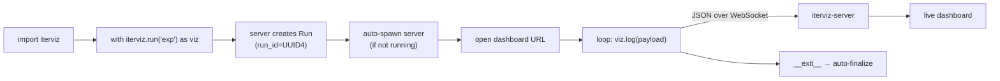
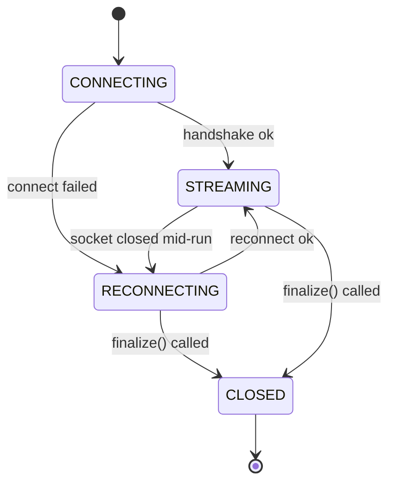

# 3.2 Usage Examples & Integration Guide

This page walks through the supported integration patterns, from the recommended context-manager API to the procedural fallback.

---

## 3.2.1 Context manager (recommended)

```python
import iterviz

with iterviz.run("my_experiment") as viz:
    for epoch in range(100):
        loss = train_step()
        viz.log({"loss": loss, "epoch": epoch})
```

* `iterviz.run("my_experiment")` auto-spawns a server, creates a Run, opens the dashboard.
* `viz.log({...})` streams a JSON frame to the server over WebSocket.
* Exiting the `with` block auto-finalizes the Run (`status="completed"` on success, `status="failed"` if an exception escapes the body).

---

## 3.2.2 Decorator

```python
import iterviz

@iterviz.track("optimization")
def optimize(viz):
    for i in range(1000):
        result = step()
        viz.log({"objective": result})

optimize()
```

The decorator injects a `viz` keyword/positional argument into the wrapped function. It is equivalent to wrapping the function body in `with iterviz.run("optimization") as viz:`.

---

## 3.2.3 Procedural API

```python
import iterviz

iterviz.init("my_experiment")
try:
    for i in range(1000):
        iterviz.log({"objective": step()})
finally:
    iterviz.finalize()
```

The procedural API is supported but not preferred — the context manager and decorator both guarantee `finalize` runs on exceptions, while the procedural form requires a manual `try`/`finally`.

---

## 3.2.4 Integration workflow



Note there is no explicit `viz.stop()` step — the context manager handles finalize on both the success and exception paths.

---

## 3.2.5 Connection lifecycle

The transport client passes through these states:



The `RECONNECTING` state lives between `STREAMING` and a fresh `CONNECTING`. While `RECONNECTING`, frames are buffered in a small bounded ring; the buffer is flushed on successful reconnect. Reconnects use exponential backoff capped at ~30 s. If the SDK gives up entirely (e.g. server permanently gone), it logs a warning and degrades to a no-op.

---

## 3.2.6 Fire-and-forget guarantees

Visualization failures **never** crash the host process:

* WebSocket connection refused → SDK logs a warning, transitions to `RECONNECTING`, your loop keeps running.
* Server crashes mid-Run → SDK queues frames, attempts reconnect, drops oldest frames if the bounded buffer overflows (with a single warning), keeps your loop running.
* Payload serialization error → frame is dropped with a warning to stderr; your loop keeps running.
* Server returns an unexpected error → SDK logs to stderr; your loop keeps running.

In all cases, the iterative process you wrapped is the priority. IterViz exists to observe it, not to interrupt it.

---

## 3.2.7 Runs and `run_id`

Every entry into `iterviz.run(...)` / `@iterviz.track(...)` / `iterviz.init(...)` creates a fresh `Run` server-side, with a UUID4 `run_id`. The SDK stamps that `run_id` onto every frame it sends. Two consecutive Runs of the same `name` are distinct in the dashboard — they appear as two entries in the Run list and can be overlaid for comparison once the Run-listing UI ships in Phase 2b.

You can attach metadata at Run creation:

```python
with iterviz.run("my_experiment", metadata={"git_sha": "abc1234", "lr": 1e-3}) as viz:
    ...
```

The metadata is stored on the `Run` object and shown in the dashboard's Run details panel.
