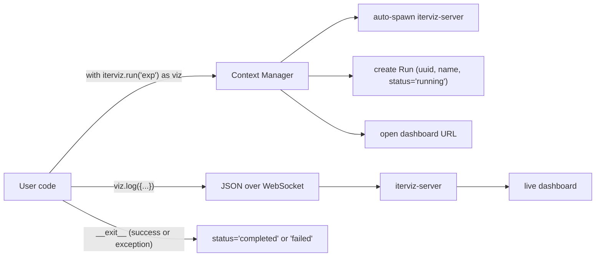

# 3. Configuration

> **TL;DR — IterViz works with zero configuration.** This page is here for users who want to opt in to advanced behavior. If you don't, the rest of this page is optional reading.

---

## 3.1 Zero-Config Defaults

IterViz is designed to be useful without any configuration file. By default:

| Behavior | Default |
|---|---|
| Server | Auto-spawned local subprocess on first `init()` / `run()` |
| Browser | Opened automatically at the dashboard URL |
| Wire format | JSON |
| Transport | WebSocket |
| Chart-type detection | Auto: scalar → line chart, array → histogram |
| Layout | Auto-grid, responsive |
| `window_size` (per-metric ring buffer) | `1000` points |
| `refresh_interval_ms` (UI repaint cadence) | `200` ms |
| Logging | Marker logs to stdout, warnings/errors to stderr |
| Error handling | Fire-and-forget (telemetry exceptions never propagate) |

That means the minimum viable use of IterViz is:

```python
import iterviz

with iterviz.run("my_experiment") as viz:
    for i in range(1000):
        viz.log({"objective": step()})
```

…and a dashboard appears in the browser with sensible charts. **YAML / dict configuration is opt-in and arrives in Phase 2a** — until then, the only knobs are arguments to `iterviz.run(...)` (most importantly `server_url`, `metadata`, and `verbose`).

---

## 3.2 Auto-detection rules

When a metric's first value arrives at the UI, IterViz picks a chart type:

| First-seen value | Inferred chart |
|---|---|
| `int` or `float` | Line chart (x = step, y = value) |
| `list[float]` / `list[int]` | Histogram (binned frequency of array contents) |
| `dict[str, float]` | Multi-series line chart (one series per key) |
| anything else | Logged as a warning; metric is dropped |

Type changes mid-Run (e.g. a metric that was scalar becoming an array) are logged as warnings and ignored — IterViz keeps using the originally-detected chart type for the duration of the Run.

---

## 3.3 Integration pattern



The context-manager API is the recommended integration pattern. The procedural `init()` / `log()` / `finalize()` and the `@iterviz.track` decorator are equivalents — see [3.2 Usage Examples](03-2-usage-examples-and-integration-guide.md).

---

## 3.4 Phase-2a configuration (preview)

When YAML / dict configuration ships in Phase 2a, the planned shape is roughly:

```yaml
server:
  port: 8765
  open_browser: true
ui:
  refresh_interval_ms: 200
  layout: auto-grid          # or "explicit" with a charts: list
  charts:                    # optional, only when layout=explicit
    - metric: loss
      type: line
      transforms: [moving_average:5]
    - metric: weights
      type: histogram
runs:
  window_size: 1000
```

All keys will be optional with the same defaults documented in 3.1. See [3.1 Configuration Schema Reference](03-1-configuration-schema-reference.md) for full details.
