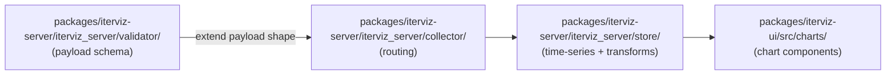

# 4. Contributing

Thanks for your interest in IterViz! This page covers the high-level "how to contribute" expectations. For setting up your dev environment see [4.1](04-1-development-environment-setup.md); for the testing strategy see [4.2](04-2-testing-strategy.md).

---

## 4.1 Repository layout reminder

```
IterViz/
├── README.md
├── Makefile
├── packages/
│   ├── iterviz-client/   # Python SDK
│   ├── iterviz-server/   # Python backend
│   └── iterviz-ui/       # TypeScript frontend
└── tests/integration/
```

When you make a change, place it in the appropriate package and update that package's tests in the same PR.

---

## 4.2 Visualization Extension Points



* **Adding a new metric kind** (e.g. confusion matrix): extend the validator in `packages/iterviz-server/iterviz_server/validator/`, add a chart component in `packages/iterviz-ui/src/charts/`, and add an auto-detection rule in `iterviz_ui/src/charts/detect.ts`.
* **Adding a new transform** (Phase 2a+): drop it into `packages/iterviz-server/iterviz_server/transforms/` and reference it from the config schema in `packages/iterviz-server/iterviz_server/config/`.
* **Adding a new transport** (Phase 2b+ for JSONL): implement the transport in `packages/iterviz-client/iterviz_client/transport/` and a matching collector endpoint in `packages/iterviz-server/iterviz_server/collector/`.

---

## 4.3 Coding conventions

* **Python**:
  * Format and lint with `ruff` (configured in each package's `pyproject.toml`).
  * Type-check with `mypy --strict` (or `--strict-equality` minimum).
  * No bare `except`; catch the narrowest exception class possible.
  * No `Any`, `getattr`, `setattr` shortcuts. If you reach for those, take it as a signal that you don't yet understand the type and read the code more carefully.
* **TypeScript**:
  * Lint with the configured ESLint preset.
  * Type-check with `tsc --noEmit` in CI.
* **General**:
  * Keep changes scoped. A PR that touches all three packages should usually be three PRs.
  * Don't introduce a `setup.py`; we use per-package `pyproject.toml`.
  * Don't reintroduce Protobuf or Shared Memory transports — they have been deliberately removed from the Phase 1 plan.

---

## 4.4 PR workflow

1. Open an issue describing the change, especially for anything user-facing.
2. Branch off `main`. Use a descriptive branch name (e.g. `feat/run-overlay-ui`).
3. Make sure `make lint`, `make typecheck`, and `make test-all` pass locally.
4. Open a PR. CI will re-run the same checks plus the integration tests.
5. Address review comments; squash-merge once approved.

---

## 4.5 Documentation

When you change behavior, update the relevant `docs/` page in the same PR. The wiki is generated from `docs/` (or, once the GitHub wiki is in use, mirrored from it), so design docs and the implementation cannot drift.
